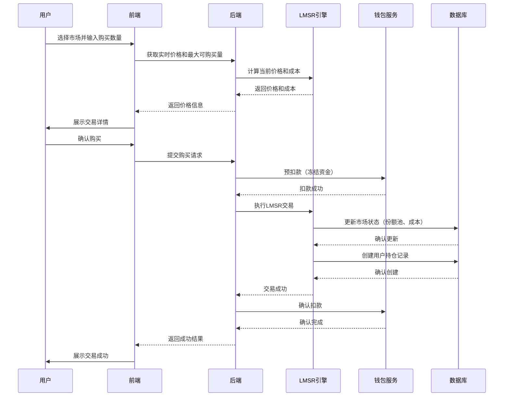
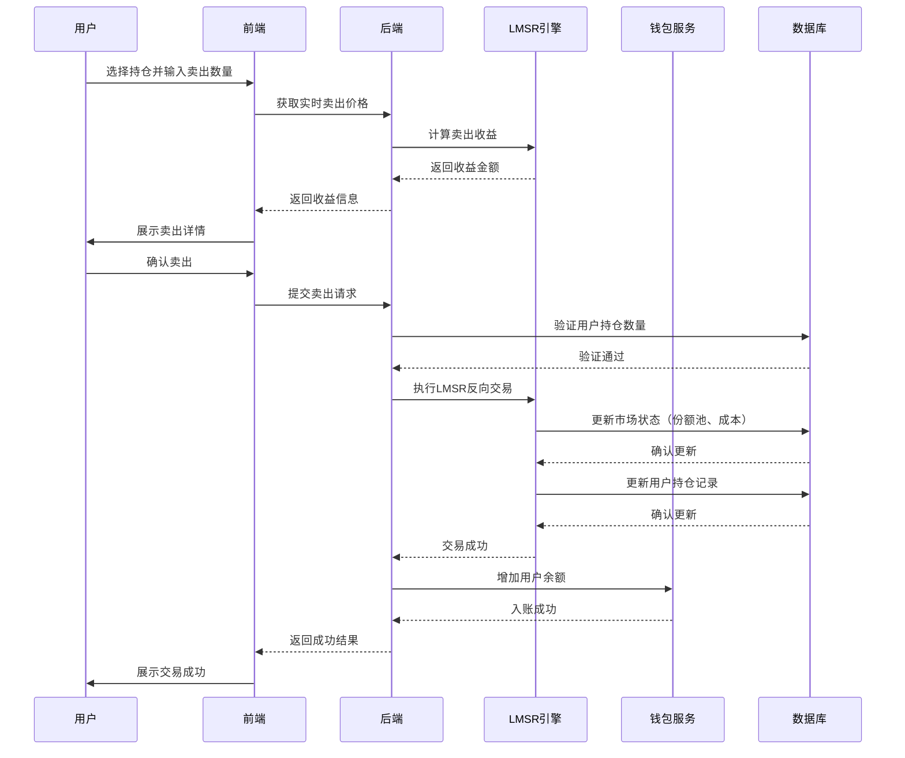

# LMSR交易引擎核心模块 PRD

## 一、模块概述

### 1.1 模块核心定位与业务价值
LMSR（Logarithmic Market Scoring Rule）交易引擎是预测市场的核心，负责处理用户对知识话题的预测交易，通过自动做市商机制提供流动性，确保市场价格反映群体智慧。该模块直接决定了平台的交易体验和市场效率，是MVP阶段的技术核心。

### 1.2 模块所属项目阶段
Phase1 MVP（10-14周，越南首发）

### 1.3 模块与其他系统模块的关联关系
- **上游依赖**：钱包与充值支付模块（资金划转）、话题与市场管理模块（市场创建）
- **下游依赖**：到期结算核心模块（结果结算）、内容风控基础模块（异常交易监控）
- **平行依赖**：用户与权限体系模块（用户身份）、运营后台核心模块（交易数据）

### 1.4 模块合规红线与技术约束
**合规红线：**
1. 禁止使用"赔率""赔率"等赌博相关词汇，统一使用"市场共识概率""份额价格"
2. 话题内容严格规避体育赛事比分、政治选举、宗教相关高风险方向
3. 必须支持18+用户准入控制，未实名认证用户无法参与预测
4. 所有交易必须使用知识币，禁止任何形式的现金交易

**技术约束：**
1. 技术栈：Python FastAPI + PostgreSQL 16 + Redis 7
2. 交易引擎：Phase1 MVP纯LMSR AMM自动做市，不支持限价单
3. 架构原则：CQRS读写分离，写操作强一致性，读操作最终一致性
4. 性能要求：支持1000+并发用户，单市场TPS > 50
5. **数据一致性**：跨模块资金操作采用Saga模式，确保钱包余额与交易记录的一致性
6. **Saga状态管理**：Saga事务状态需持久化存储，支持断点恢复和超时处理

## 二、角色与权限

### 2.1 该模块涉及的用户角色
| 角色 | 权限边界 |
|------|----------|
| 普通用户 | 查看市场、购买/卖出份额、查看持仓、查看交易记录 |
| 市场创建者 | 创建市场（需审核）、查看自己创建市场的统计数据 |
| 管理员 | 查看所有市场数据、强制关闭市场、调整市场参数 |
| 审核人员 | 审核市场创建申请、监控异常市场 |
| 运营人员 | 查看交易统计报表、导出交易数据 |

### 2.2 各角色在该模块的操作权限边界
- **普通用户**：只能操作已开启的市场，无法创建或修改市场
- **市场创建者**：仅能查看自己创建的市场数据，无法修改已发布市场
- **管理员**：拥有全部权限，但关键操作需二次确认
- **审核/运营**：只读权限为主，无交易操作权限

## 三、功能范围与优先级

### 3.1 核心功能清单（P0必须实现，MVP必做）
1. LMSR自动做市商引擎实现
2. 市场份额购买功能
3. 市场份额卖出功能
4. 实时市场价格计算与展示
5. 用户持仓管理
6. 交易记录查询（最近30天）
7. 市场状态管理（开启/关闭/到期）
8. 基础交易风控（防刷、防异常交易）
9. 市场深度数据展示
10. 交易确认与撤销（仅限未成交）

### 3.2 次要功能清单（P1迭代实现，MVP不做）
1. 限价单交易
2. 条件单（止盈止损）
3. 交易历史导出
4. 高级市场分析图表
5. 社交交易（跟单）

### 3.3 未来扩展功能清单（P2及以后实现）
1. 完整订单簿
2. 杠杆交易
3. API交易接口
4. 机构级交易工具

### 3.4 明确MVP阶段不做的功能边界
- 不支持限价单交易（仅LMSR即时成交）
- 不支持条件单和自动化交易
- 不支持交易历史超过30天的查询
- 不支持杠杆和保证金交易
- 不支持API交易接口

## 四、业务流程与逻辑

### 4.1 核心业务主流程

#### 4.1.1 购买份额主流程


#### 4.1.2 卖出份额主流程


### 4.2 详细业务规则

#### 4.2.1 LMSR算法规则
- **基础公式**：`cost(q) = b * ln(Σexp(q_i/b))`
  - `q`: 各结果的份额向量
  - `b`: 流动性参数（market_maker_fund）
  - `cost`: 总成本函数
- **价格计算**：`price_i = ∂cost/∂q_i = exp(q_i/b) / Σexp(q_j/b)`
- **交易成本**：`Δcost = cost(q_new) - cost(q_old)`

#### 4.2.2 流动性参数设置
- 初始流动性基金：10,000 知识币（每个市场）
- 流动性参数b = 流动性基金 / 10 = 1,000
- 流动性基金由平台提供，不向用户收取

#### 4.2.3 交易限制规则
- 最小交易量：1 份额
- 最大单笔交易：受限于用户余额和市场流动性
- 交易时间：市场开启期间（创建后到到期前）
- 持仓限制：单用户单市场最大持仓不超过市场总流通量的50%

#### 4.2.4 市场价格规则
- 价格范围：0-100%（显示为百分比）
- 价格精度：小数点后2位（0.01%）
- 价格更新：实时计算，每次交易后立即更新
- 价格显示：多结果市场显示各结果概率，总和为100%

### 4.3 异常场景处理方案

#### 4.3.1 网络异常
- **交易提交超时**：前端显示"处理中"，提供交易状态查询
- **LMSR计算超时**：返回错误，建议用户稍后重试
- **钱包服务不可用**：阻断交易流程，提示服务维护

#### 4.3.2 并发冲突
- 使用数据库行级锁防止同一市场并发交易
- 用户持仓更新使用乐观锁防止并发修改
- 市场状态变更使用分布式锁

#### 4.3.3 数据异常
- 份额数量负数：系统自动告警，人工介入
- 价格计算异常（NaN/Infinity）：使用兜底价格（历史价格）
- 持仓与交易记录不一致：定时对账任务修复

#### 4.3.4 市场异常
- 流动性不足：动态调整最小交易量，避免价格剧烈波动
- 异常大额交易：触发风控审核，可能延迟执行
- 市场创建参数错误：管理员可强制修正

## 五、前端页面与交互要求

### 5.1 页面清单与原型跳转逻辑
1. **市场列表页**：展示所有可交易市场，按类别/热度排序
2. **市场详情页**：展示市场信息、价格图表、交易表单
3. **交易确认页**：展示交易详情、成本/收益预览
4. **持仓管理页**：展示用户所有持仓、支持快速卖出
5. **交易记录页**：展示最近30天交易记录
6. **市场深度页**：展示市场流动性深度图

### 5.2 核心页面元素与交互规则
- **价格图表**：实时更新的概率走势图，支持时间范围切换
- **交易表单**：数量输入、实时价格/成本预览、最大可交易量提示
- **持仓卡片**：结果选项、持有份额、当前价值、收益率
- **交易按钮**：购买/卖出按钮根据用户持仓状态动态显示
- **市场状态标签**：清晰标识市场状态（交易中/即将到期/已结束）

### 5.3 多语言适配要求
- 支持越南语、英语
- 概率显示格式：xx.xx%（越南习惯）
- 数字格式：千分位分隔符按当地习惯
- 日期时间格式：DD/MM/YYYY HH:mm
- **文本扩展考虑**：越南语文本比英语长约20-30%，UI布局需预留足够空间

### 5.4 响应式适配要求
- 适配手机竖屏（320px-414px）
- 图表在小屏幕上简化显示
- 交易表单位于页面底部，便于拇指操作
- 持仓信息支持横向滑动查看更多

### 5.5 可访问性要求（新增）
- **色彩对比度**：所有文本与背景对比度 ≥ 4.5:1（WCAG AA标准）
- **焦点指示器**：所有可交互元素必须有清晰的键盘焦点指示
- **屏幕阅读器支持**：
  - 价格图表提供ARIA标签描述当前价格趋势
  - 交易按钮明确标识操作类型（购买/卖出）和金额
  - 表单字段关联正确的label标签
- **键盘导航**：支持Tab键在所有交互元素间导航，Enter/Space键触发操作
- **错误处理**：错误信息以文本形式提供，不依赖颜色区分
- **动态内容更新**：实时价格更新使用ARIA live regions通知屏幕阅读器

### 5.6 UI组件规范（新增）
**价格图表组件**：
- 支持触摸缩放和拖拽查看历史数据
- 提供高对比度模式（色盲友好）
- 加载状态显示骨架屏，避免布局跳动

**交易表单组件**：
- 输入框自动格式化数字（千分位分隔）
- 实时验证输入范围（最小/最大交易量）
- 错误状态显示具体原因和解决方案

**持仓卡片组件**：
- 支持长按快速操作（卖出/查看详情）
- 视觉层次清晰：结果选项 > 持有份额 > 当前价值 > 收益率
- 空状态提供引导性文案和操作建议

## 六、数据模型与接口要求

### 6.1 核心数据实体与字段要求

#### 6.1.1 市场表 (markets)
| 字段名 | 类型 | 必填 | 描述 |
|--------|------|------|------|
| id | UUID | 是 | 市场ID |
| title | VARCHAR(255) | 是 | 市场标题 |
| description | TEXT | 是 | 市场描述 |
| category | VARCHAR(50) | 是 | 分类（科技/商业/文化/学术） |
| outcome_count | INT | 是 | 结果选项数量 |
| outcomes | JSONB | 是 | 结果选项列表 |
| liquidity_fund | BIGINT | 是 | 流动性基金（知识币） |
| b_parameter | BIGINT | 是 | LMSR参数b |
| status | VARCHAR(20) | 是 | 状态（active/closed/expired） |
| expires_at | TIMESTAMP | 是 | 到期时间 |
| creator_id | UUID | 是 | 创建者ID |
| created_at | TIMESTAMP | 是 | 创建时间 |
| updated_at | TIMESTAMP | 是 | 更新时间 |

#### 6.1.2 份额池表 (market_pools)
| 字段名 | 类型 | 必填 | 描述 |
|--------|------|------|------|
| market_id | UUID | 是 | 市场ID |
| outcome_index | INT | 是 | 结果索引 |
| shares | BIGINT | 是 | 份额数量（整数存储，精度1e-6） |
| created_at | TIMESTAMP | 是 | 创建时间 |
| updated_at | TIMESTAMP | 是 | 更新时间 |

#### 6.1.3 用户持仓表 (user_positions)
| 字段名 | 类型 | 必填 | 描述 |
|--------|------|------|------|
| id | UUID | 是 | 持仓ID |
| user_id | UUID | 是 | 用户ID |
| market_id | UUID | 是 | 市场ID |
| outcome_index | INT | 是 | 结果索引 |
| shares | BIGINT | 是 | 持有份额（整数存储，精度1e-6） |
| avg_cost | BIGINT | 是 | 平均成本（知识币） |
| created_at | TIMESTAMP | 是 | 创建时间 |
| updated_at | TIMESTAMP | 是 | 更新时间 |

#### 6.1.4 交易记录表 (trades)
| 字段名 | 类型 | 必填 | 描述 |
|--------|------|------|------|
| id | UUID | 是 | 交易ID |
| user_id | UUID | 是 | 用户ID |
| market_id | UUID | 是 | 市场ID |
| outcome_index | INT | 是 | 结果索引 |
| trade_type | VARCHAR(10) | 是 | 交易类型（buy/sell） |
| shares | BIGINT | 是 | 交易份额（整数存储，精度1e-6） |
| price | BIGINT | 是 | 交易价格（整数存储，精度1e-6，表示0.01%） |
| cost | BIGINT | 是 | 交易成本/收益（知识币） |
| created_at | TIMESTAMP | 是 | 创建时间 |

### 6.2 核心接口清单与入参/出参核心要求

#### 6.2.1 获取市场列表
- **URL**: GET /api/v1/markets
- **入参**: category=tech, page=1, limit=20
- **出参**: 
  ```json
  {
    "markets": [
      {
        "id": "uuid",
        "title": "AI将取代多少工作岗位？",
        "outcomes": ["<30%", "30-70%", ">70%"],
        "current_prices": [0.25, 0.45, 0.30],
        "expires_at": "2026-03-26T00:00:00Z",
        "status": "active"
      }
    ],
    "total": 100,
    "page": 1,
    "limit": 20
  }
  ```

#### 6.2.2 获取市场详情
- **URL**: GET /api/v1/markets/{market_id}
- **入参**: 无
- **出参**: 
  ```json
  {
    "market": {
      "id": "uuid",
      "title": "AI将取代多少工作岗位？",
      "description": "预测AI技术对就业市场的影响...",
      "outcomes": ["<30%", "30-70%", ">70%"],
      "current_prices": [0.25, 0.45, 0.30],
      "liquidity": 10000,
      "expires_at": "2026-03-26T00:00:00Z",
      "status": "active",
      "user_position": {
        "outcome_index": 1,
        "shares": 100,
        "avg_cost": 4500
      }
    }
  }
  ```

#### 6.2.3 获取交易报价
- **URL**: POST /api/v1/markets/{market_id}/quote
- **入参**: 
  ```json
  {
    "outcome_index": 1,
    "shares": 100,
    "trade_type": "buy"
  }
  ```
- **出参**: 
  ```json
  {
    "price": 0.45,
    "cost": 4500,
    "new_price": 0.46
  }
  ```

#### 6.2.4 执行交易
- **URL**: POST /api/v1/markets/{market_id}/trade
- **入参**: 
  ```json
  {
    "outcome_index": 1,
    "shares": 100,
    "trade_type": "buy"
  }
  ```
- **出参**: 
  ```json
  {
    "trade_id": "uuid",
    "status": "success",
    "new_position": {
      "outcome_index": 1,
      "shares": 100,
      "avg_cost": 4500
    }
  }
  ```

#### 6.2.5 获取用户持仓
- **URL**: GET /api/v1/positions
- **入参**: page=1, limit=20
- **出参**: 
  ```json
  {
    "positions": [...],
    "total": 5,
    "page": 1,
    "limit": 20
  }
  ```

#### 6.2.6 获取交易记录
- **URL**: GET /api/v1/trades
- **入参**: page=1, limit=20
- **出参**: 同持仓格式

### 6.3 数据读写性能要求
- 市场列表查询：< 200ms (P95，20条记录）
- 市场详情查询：< 150ms (P95)
- 交易报价计算：< 100ms (P95)
- 交易执行：< 300ms (P95)
- 并发支持：50 TPS per market

### 6.4 数据存储与归档要求
- 市场数据：永久存储
- 交易记录：永久存储
- 操作日志：保留180天
- 敏感数据：无需特殊加密（无个人敏感信息）

## 七、非功能需求

### 7.1 性能指标
- 接口响应时间：< 300ms (P95)
- 并发量支持：1000+ 用户在线，50 TPS per market
- 页面加载时长：首屏 < 2s，图表渲染 < 1s

### 7.2 可用性要求
- 服务可用性SLA：99.9%
- 故障降级策略：
  - LMSR引擎不可用：返回缓存价格，禁止交易
  - 数据库只读：允许查询，禁止交易
  - Redis不可用：降级为数据库直查

### 7.3 可扩展性要求
- LMSR参数可配置，便于后续调整
- 市场类型扩展预留（二元/多元/数值型）
- 交易引擎插件化设计，便于Phase2替换

### 7.4 兼容性要求
- 浏览器：Chrome、Safari、Firefox最新2个版本
- 设备：iOS 12+、Android 8+
- 语言：越南语、英语

### 7.5 监控告警指标
- **核心业务指标**：
  - 交易成功率：阈值 > 99.5%，低于阈值触发告警
  - 交易响应时间：阈值 < 300ms(P95)，超过阈值触发告警
  - 市场价格异常波动：单次价格变动 > 20%（触发告警）
  - 并发交易冲突率：阈值 < 0.1%，超过阈值触发告警
  
- **系统性能指标**：
  - CPU使用率：阈值 < 70%，超过阈值触发告警
  - 内存使用率：阈值 < 80%，超过阈值触发告警
  - 数据库连接池使用率：阈值 < 75%，超过阈值触发告警
  - Redis命中率：阈值 > 95%，低于阈值触发告警
  
- **资金安全指标**：
  - 持仓与交易记录不一致：实时检测，发现即告警
  - 异常大额交易：单笔交易 > 10,000知识币（触发人工审核）
  - 高频交易行为：> 50次/分钟/用户（触发风控拦截）
  
- **告警分级**：
  - P0（紧急）：资金异常、数据不一致、服务不可用
  - P1（高）：性能严重下降、异常交易、价格异常
  - P2（中）：资源使用率过高、成功率下降
  - P3（低）：一般性能问题、非关键错误

## 八、安全与合规要求

### 8.1 接口权限控制要求
- 所有交易接口需要JWT Token认证
- 用户只能操作自己的持仓和交易
- 市场创建和管理需要额外权限

### 8.2 数据加密与脱敏要求
- 交易数据无需特殊加密
- 用户ID在日志中部分脱敏
- API响应中的敏感信息：无

### 8.3 操作审计日志要求
- 记录所有交易操作
- 包含操作人、操作时间、操作类型、操作详情
- 日志保留180天，支持按用户ID、市场ID、时间范围查询

### 8.4 合规校验规则与拦截逻辑
- 18+用户准入控制
- 话题内容合规检查
- 异常交易行为监控（大额、高频）
- 市场创建审核流程

### 8.5 防刷、防并发、防篡改要求
- 防重复提交：前端按钮防重 + 后端幂等性校验
- 防并发冲突：数据库行级锁 + 乐观锁
- 防篡改：HTTPS传输 + 请求签名验证
- 防刷：IP限流（20次/分钟）、行为分析、异常交易拦截

## 九、埋点与数据分析要求

### 9.1 核心埋点事件清单
- market_view: 市场页面访问
- market_search: 市场搜索
- quote_request: 获取交易报价
- trade_execute: 执行交易
- position_view: 持仓查看
- trade_record_view: 交易记录查看

### 9.2 核心数据指标定义
- 交易转化率 = 成功交易次数 / 报价请求次数
- 平均交易金额 = 总交易金额 / 交易次数
- 市场活跃度 = 日活跃交易用户数 / 市场总数
- 用户持仓分布 = 各结果选项的持仓占比

### 9.3 数据统计与看板要求
- 实时交易监控看板
- 市场热度排行榜
- 用户交易行为分析
- 异常交易告警

## 十、验收标准

### 10.1 功能验收标准
- [ ] LMSR算法正确实现，价格计算准确
- [ ] 用户可正常购买/卖出市场份额
- [ ] 实时价格更新，交易后立即反映
- [ ] 用户持仓准确记录和更新
- [ ] 交易记录完整保存
- [ ] 市场状态正确管理（开启/关闭/到期）
- [ ] 并发交易场景下数据一致性保证
- [ ] 异常交易场景正确拦截和处理

### 10.2 性能验收标准
- [ ] 市场详情查询响应时间 < 150ms (P95)
- [ ] 交易执行响应时间 < 300ms (P95)
- [ ] 系统支持50 TPS per market并发交易
- [ ] 页面首屏加载时间 < 2s

### 10.3 安全合规验收标准
- [ ] 通过第三方安全扫描（无高危漏洞）
- [ ] 18+用户准入控制100%有效
- [ ] 话题内容合规检查覆盖所有市场
- [ ] 所有交易操作都有完整审计日志
- [ ] 防刷机制有效拦截异常交易

### 10.4 兼容性验收标准
- [ ] 在iOS和Android主流机型上正常运行
- [ ] 越南语和英语界面显示正确
- [ ] 在Chrome、Safari、Firefox浏览器上功能正常

## 十一、附件

### 11.1 产品原型图
- 市场列表页原型
- 市场详情页原型
- 交易流程原型
- 持仓管理页原型

### 11.2 流程图/时序图
- 购买份额主流程时序图（见4.1.1）
- 卖出份额主流程时序图（见4.1.2）
- LMSR算法流程图

### 11.3 相关合规文件/参考资料
- 越南Decree 06/2017/ND-CP博彩管制条例摘要
- LMSR算法学术论文参考
- 预测市场最佳实践指南

### 11.4 版本变更记录
| 版本 | 日期 | 修改内容 | 修改人 |
|------|------|----------|--------|
| v1.0 | 2026-02-26 | 初稿 | 产品经理 |