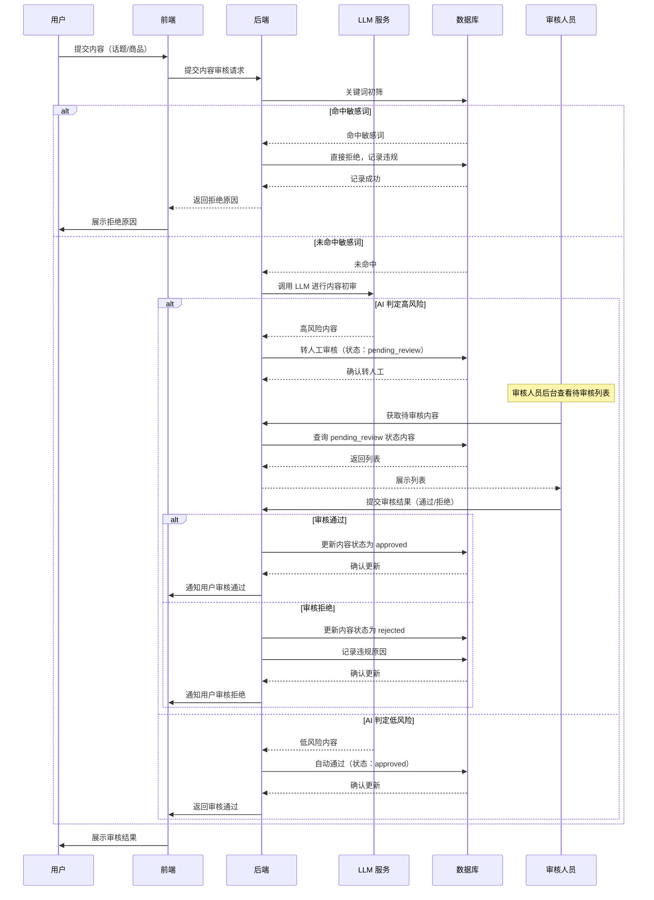
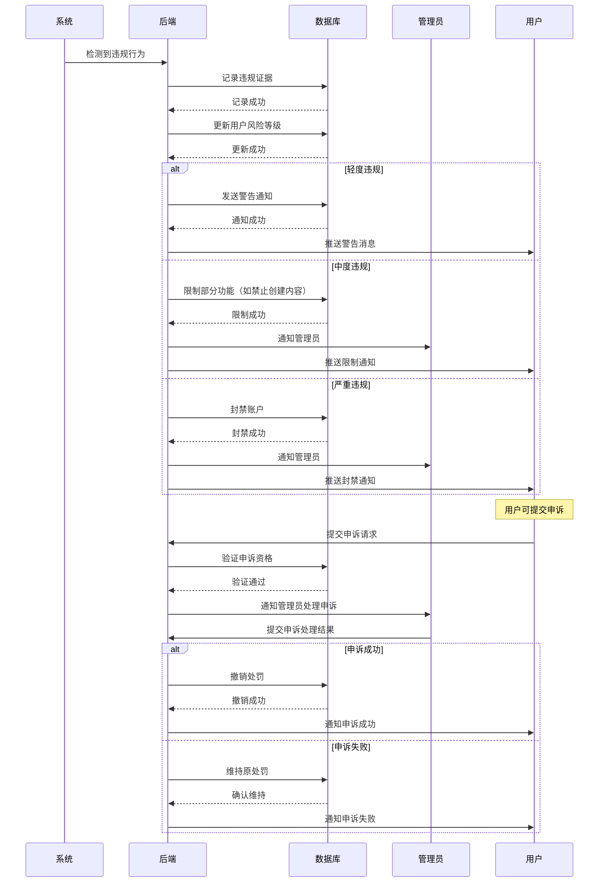

# 内容风控基础模块 PRD

## 一、模块概述

### 1.1 模块核心定位与业务价值
内容风控基础模块是平台的安全防护体系，负责内容审核、用户行为监控、风险识别与拦截、违规处理等核心风控功能。该模块直接关系到平台的合规性和安全性，是MVP阶段必须实现的核心模块。

### 1.2 模块所属项目阶段
Phase1 MVP（10-14周，越南首发）

### 1.3 模块与其他系统模块的关联关系
- **上游依赖**：所有用户生成内容模块（话题创建、商品提交、用户评论等）
- **下游依赖**：运营后台核心模块（风控数据展示、违规处理）
- **平行依赖**：话题与市场管理模块、纯知识币商城模块、用户与权限体系模块

### 1.4 模块合规红线与技术约束
**合规红线：**
1. 话题内容严格规避体育赛事比分、政治选举、宗教相关高风险方向
2. 所有用户生成内容必须经过审核或 AI 初审才能上线
3. 违规行为必须有完整的证据链和处置记录
4. 必须支持监管机构的数据调取要求

**技术约束：**
1. 技术栈：Python FastAPI + PostgreSQL 16 + Redis 7
2. AI 能力：仅调用 LLM API 实现内容初审，无自研算法
3. 架构原则：单体应用起步，CQRS 读写分离
4. 实时性要求：高风险内容实时拦截，普通内容异步审核

## 二、角色与权限

### 2.1 该模块涉及的用户角色
| 角色 | 权限边界 |
|------|----------|
| 普通用户 | 查看自己的内容状态、提交申诉、查看违规记录 |
| 审核人员 | 内容审核、违规判定、申诉处理 |
| 管理员 | 风控规则配置、违规用户处理、风控数据查看 |
| 运营人员 | 风控数据统计、违规行为分析、导出风控报表 |
| 财务人员 | 无权限（风控模块不涉及资金） |

### 2.2 各角色在该模块的操作权限边界
- **普通用户**：只能查看自己的内容和违规记录，无法查看他人信息
- **审核人员**：专注于内容审核和违规判定，无规则配置权限
- **管理员**：拥有全部风控管理权限，但规则修改需二次确认
- **运营人员**：只读权限为主，无操作权限

## 三、功能范围与优先级

### 3.1 核心功能清单（P0 必须实现，MVP 必做）
1. 内容关键词过滤
2. AI 内容初审（调用 LLM API）
3. 人工审核流程
4. 违规行为识别与记录
5. 用户风险等级评估
6. 违规内容处理（下架、删除）
7. 违规用户处理（警告、限制、封禁）
8. 用户申诉流程
9. 风控规则配置
10. 风控数据报表

### 3.2 次要功能清单（P1 迭代实现，MVP 不做）
1. 图片内容识别（OCR + 图像识别）
2. 用户行为画像
3. 自动化风控策略
4. 风险预警系统
5. 第三方风控数据接入

### 3.3 未来扩展功能清单（P2 及以后实现）
1. 机器学习风控模型
2. 实时风险评分系统
3. 关联账户识别
4. 黑产情报接入
5. 智能风控决策引擎

### 3.4 明确 MVP 阶段不做的功能边界
- 不支持图片内容识别（仅文本内容）
- 不支持用户行为画像和关联分析
- 不支持自动化风控策略（仅规则匹配）
- 不支持风险预警系统
- 不支持第三方风控数据接入

## 四、业务流程与逻辑

### 4.1 核心业务主流程

#### 4.1.1 内容审核主流程


#### 4.1.2 违规处理主流程


### 4.2 详细业务规则

#### 4.2.1 敏感词规则
- **敏感词库**：政治、宗教、体育、色情、暴力等高风险词汇
- **匹配方式**：精确匹配 + 模糊匹配（同音字、变体）
- **更新机制**：管理员可动态添加/删除敏感词
- **多语言支持**：越南语、英语敏感词库独立维护

#### 4.2.2 AI 初审规则
- **调用方式**：同步调用 LLM API
- **判定标准**：高风险（转人工）、低风险（自动通过）
- **超时处理**：API 超时（>3 秒）转人工审核
- **成本控制**：单次内容限制最大字数（1000 字）

#### 4.2.3 用户风险等级规则
- **等级划分**：低风险、中风险、高风险、黑名单
- **评估维度**：违规次数、违规类型、时间密度、申诉成功率
- **升级规则**：累计违规自动升级，严重违规直接升级
- **降级规则**：30 天无违规自动降级，良好行为可加速降级

### 4.2.4 创作者信用等级体系
- **信用等级**：S（优秀）、A（良好）、B（一般）、C（风险）
- **评估维度**：
  - 内容质量评分（用户反馈、审核通过率）
  - 违规历史记录（违规次数、严重程度）
  - 活跃度指标（内容发布频率、用户互动）
  - 申诉成功率（争议处理表现）
- **权益差异**：
  - S级：AI初审通过后自动上线，无需人工审核
  - A级：AI初审通过后快速通道（2小时内人工审核）
  - B级：标准审核流程（24小时内人工审核）
  - C级：严格审核流程（48小时内人工审核，需额外材料）

### 4.2.5 AI与人工审核分工边界
- **AI初审职责**：
  - 敏感词检测和过滤
  - 基础内容分类和风险评级
  - S级创作者内容的最终审核决策
  - 高风险内容的初步识别和标记
- **人工审核职责**：
  - A/B/C级创作者内容的最终审核决策
  - AI标记的高风险内容复核
  - 边界案例和复杂内容判断
  - 申诉内容的复核处理
- **协作机制**：
  - AI初审结果置信度 > 95%：S级创作者内容自动通过
  - AI初审结果置信度 80-95%：转人工快速通道
  - AI初审结果置信度 < 80%：转人工标准通道
  - AI初审超时或失败：转人工标准通道

#### 4.2.4 违规处罚规则
| 违规等级 | 处罚措施 | 生效条件 |
|----------|----------|----------|
| 轻度违规 | 警告通知 | 首次违规或轻微内容问题 |
| 中度违规 | 功能限制（7 天） | 累计 3 次轻度违规或中等内容问题 |
| 严重违规 | 功能限制（30 天） | 累计 5 次中度违规或严重内容问题 |
| 极严重违规 | 永久封禁 | 违法内容或累计 10 次严重违规 |

#### 4.2.5 申诉处理规则
- **申诉时效**：处罚后 7 天内可申诉
- **申诉次数**：单次处罚最多申诉 2 次
- **处理时效**：48 小时内完成申诉处理
- **申诉材料**：必须提供申诉理由和相关证据

### 4.3 异常场景处理方案

#### 4.3.1 网络异常
- **AI 服务不可用**：全部转人工审核，提示审核时间延长
- **数据库不可用**：内容提交失败，提示稍后重试
- **通知服务不可用**：记录通知队列，定时重试

#### 4.3.2 并发冲突
- 使用数据库行级锁防止同一内容并发审核
- 用户风险等级更新使用乐观锁防止并发修改
- 处罚操作使用分布式锁防止重复执行

#### 4.3.3 数据异常
- 敏感词库异常：使用兜底词库，告警通知管理员
- AI 判定结果异常：记录异常日志，转人工审核
- 用户风险等级异常：人工核查修复，记录修复日志

#### 4.3.4 误判处理
- 用户申诉通道：提供便捷的申诉入口
- 人工复核机制：申诉内容必须由人工复核
- 误判记录：记录误判案例，优化审核规则

## 五、前端页面与交互要求

### 5.1 页面清单与原型跳转逻辑
1. **内容审核后台**：待审核列表、已审核列表、审核详情
2. **违规管理页面**：违规记录列表、违规详情、处罚执行
3. **用户申诉页面**：申诉列表、申诉详情、申诉处理
4. **风控规则配置**：敏感词管理、AI 规则配置、处罚规则配置
5. **风控数据报表**：违规统计、审核效率、用户风险分布
6. **用户风控中心**：我的违规记录、申诉入口、风险等级展示

### 5.2 核心页面元素与交互规则
- **内容预览区**：清晰展示待审核内容，高亮敏感词
- **审核操作区**：通过/拒绝按钮，拒绝原因选择器
- **违规记录表**：支持筛选、排序、导出
- **处罚执行区**：处罚类型选择、处罚时长设置、处罚原因填写
- **数据可视化**：违规趋势图、风险等级分布图

### 5.3 多语言适配要求
- 支持越南语、英语
- 敏感词库多语言独立维护
- 违规通知多语言模板
- 日期时间格式：DD/MM/YYYY HH:mm

### 5.4 响应式适配要求
- 主要适配桌面端（1280px+）
- 表格在小屏幕上支持横向滚动
- 关键操作按钮在移动端保持可点击
- 内容预览区自适应宽度

## 六、数据模型与接口要求

### 6.1 核心数据实体与字段要求

#### 6.1.1 敏感词库表 (sensitive_words)
| 字段名 | 类型 | 必填 | 描述 |
|--------|------|------|------|
| id | UUID | 是 | 敏感词 ID |
| word | VARCHAR(255) | 是 | 敏感词内容 |
| category | VARCHAR(50) | 是 | 分类（politics/religion/sports/porn/violence等） |
| language | VARCHAR(10) | 是 | 语言（vi/en） |
| match_type | VARCHAR(20) | 是 | 匹配类型（exact/fuzzy） |
| is_active | BOOLEAN | 是 | 是否启用 |
| created_at | TIMESTAMP | 是 | 创建时间 |
| updated_at | TIMESTAMP | 是 | 更新时间 |

#### 6.1.2 内容审核记录表 (content_reviews)
| 字段名 | 类型 | 必填 | 描述 |
|--------|------|------|------|
| id | UUID | 是 | 审核记录 ID |
| content_type | VARCHAR(50) | 是 | 内容类型（topic/product/comment） |
| content_id | UUID | 是 | 内容 ID |
| user_id | UUID | 是 | 提交用户 ID |
| ai_result | VARCHAR(20) | 否 | AI 初审结果（high_risk/low_risk/error） |
| ai_confidence | FLOAT | 否 | AI 置信度（0-1） |
| manual_result | VARCHAR(20) | 否 | 人工审核结果（approved/rejected） |
| reject_reason | TEXT | 否 | 拒绝原因 |
| auditor_id | UUID | 否 | 审核人 ID |
| status | VARCHAR(20) | 是 | 状态（pending/ai_review/manual_review/approved/rejected） |
| created_at | TIMESTAMP | 是 | 创建时间 |
| updated_at | TIMESTAMP | 是 | 更新时间 |

#### 6.1.3 违规记录表 (violations)
| 字段名 | 类型 | 必填 | 描述 |
|--------|------|------|------|
| id | UUID | 是 | 违规 ID |
| user_id | UUID | 是 | 违规用户 ID |
| violation_type | VARCHAR(50) | 是 | 违规类型（sensitive_content/spam/fraud等） |
| severity | VARCHAR(20) | 是 | 严重程度（light/moderate/severe/critical） |
| content_type | VARCHAR(50) | 是 | 关联内容类型 |
| content_id | UUID | 否 | 关联内容 ID |
| evidence | JSONB | 是 | 违规证据（内容快照、截图等） |
| penalty_type | VARCHAR(50) | 是 | 处罚类型（warning/restriction/ban） |
| penalty_duration | INT | 否 | 处罚时长（天） |
| status | VARCHAR(20) | 是 | 状态（pending/appealed/resolved） |
| created_at | TIMESTAMP | 是 | 创建时间 |
| updated_at | TIMESTAMP | 是 | 更新时间 |

#### 6.1.4 用户风险等级表 (user_risk_levels)
| 字段名 | 类型 | 必填 | 描述 |
|--------|------|------|------|
| user_id | UUID | 是 | 用户 ID |
| risk_level | VARCHAR(20) | 是 | 风险等级（low/medium/high/blacklist） |
| risk_score | INT | 是 | 风险分数（0-100） |
| violation_count | INT | 是 | 违规次数 |
| last_violation_at | TIMESTAMP | 否 | 最近违规时间 |
| next_downgrade_at | TIMESTAMP | 否 | 下次降级时间 |
| created_at | TIMESTAMP | 是 | 创建时间 |
| updated_at | TIMESTAMP | 是 | 更新时间 |

#### 6.1.5 用户申诉表 (user_appeals)
| 字段名 | 类型 | 必填 | 描述 |
|--------|------|------|------|
| id | UUID | 是 | 申诉 ID |
| user_id | UUID | 是 | 申诉用户 ID |
| violation_id | UUID | 是 | 关联违规 ID |
| reason | TEXT | 是 | 申诉理由 |
| evidence | JSONB | 否 | 申诉证据 |
| status | VARCHAR(20) | 是 | 状态（pending/approved/rejected） |
| reviewer_id | UUID | 否 | 审核人 ID |
| review_notes | TEXT | 否 | 审核备注 |
| reviewed_at | TIMESTAMP | 否 | 审核时间 |
| created_at | TIMESTAMP | 是 | 创建时间 |
| updated_at | TIMESTAMP | 是 | 更新时间 |

### 6.2 核心接口清单与入参/出参核心要求

#### 6.2.1 提交内容审核
- **URL**: POST /api/v1/content/submit
- **入参**: 
  ```json
  {
    "content_type": "topic",
    "content_id": "uuid",
    "content_text": "内容文本..."
  }
  ```
- **出参**: 
  ```json
  {
    "review_id": "uuid",
    "status": "pending",
    "estimated_time": "24 小时内"
  }
  ```

#### 6.2.2 获取待审核列表
- **URL**: GET /api/v1/content/reviews/pending
- **入参**: content_type=topic, page=1, limit=20
- **出参**: 
  ```json
  {
    "reviews": [...],
    "total": 25,
    "page": 1,
    "limit": 20
  }
  ```

#### 6.2.3 提交审核结果
- **URL**: POST /api/v1/content/reviews/{review_id}/submit
- **入参**: 
  ```json
  {
    "result": "approved",
    "reason": ""
  }
  ```
- **出参**: 
  ```json
  {
    "message": "审核成功",
    "new_status": "approved"
  }
  ```

#### 6.2.4 查询违规记录
- **URL**: GET /api/v1/violations
- **入参**: user_id=uuid, page=1, limit=20
- **出参**: 
  ```json
  {
    "violations": [...],
    "total": 5,
    "page": 1,
    "limit": 20
  }
  ```

#### 6.2.5 执行违规处罚
- **URL**: POST /api/v1/violations/{violation_id}/penalty
- **入参**: 
  ```json
  {
    "penalty_type": "restriction",
    "penalty_duration": 7,
    "reason": "Multiple violations"
  }
  ```
- **出参**: 
  ```json
  {
    "message": "处罚执行成功",
    "penalty_expires_at": "2026-03-05T00:00:00Z"
  }
  ```

#### 6.2.6 提交用户申诉
- **URL**: POST /api/v1/appeals
- **入参**: 
  ```json
  {
    "violation_id": "uuid",
    "reason": "我认为处罚有误，因为...",
    "evidence": ["url1", "url2"]
  }
  ```
- **出参**: 
  ```json
  {
    "appeal_id": "uuid",
    "status": "pending",
    "estimated_time": "48 小时内"
  }
  ```

#### 6.2.7 处理用户申诉
- **URL**: POST /api/v1/appeals/{appeal_id}/review
- **入参**: 
  ```json
  {
    "result": "approved",
    "notes": "申诉理由成立，撤销处罚"
  }
  ```
- **出参**: 
  ```json
  {
    "message": "申诉处理成功",
    "new_status": "approved"
  }
  ```

### 6.3 数据读写性能要求
- 内容审核提交：< 300ms (P95，不含 AI 调用）
- AI 初审调用：< 3000ms (P95，含外部 API）
- 违规记录查询：< 200ms (P95，20 条记录）
- 处罚执行：< 300ms (P95)
- 并发支持：50 TPS

### 6.4 数据存储与归档要求
- 审核记录：永久存储
- 违规记录：永久存储
- 申诉记录：永久存储
- 操作日志：保留 180 天
- 敏感数据：加密存储（AES-256）

## 七、非功能需求

### 7.1 性能指标
- 接口响应时间：< 300ms (P95，不含 AI 调用）
- AI 初审延迟：< 3000ms (P95)
- 并发量支持：50 TPS
- 页面加载时长：首屏 < 2s

### 7.2 可用性要求
- 服务可用性 SLA：99.9%
- 故障降级策略：
  - AI 服务不可用：全部转人工审核
  - 数据库只读：允许查询，禁止审核操作
  - 通知服务不可用：记录通知队列，定时重试

### 7.3 可扩展性要求
- 敏感词库支持动态扩展
- AI 服务支持多供应商切换
- 风控规则配置化，便于后续扩展

### 7.4 兼容性要求
- 浏览器：Chrome、Safari、Firefox 最新 2 个版本
- 设备：桌面端（1280px+），基本适配平板
- 语言：越南语、英语

### 7.5 监控告警指标
**核心业务指标监控：**
- **内容审核队列长度**：阈值 > 100 条，告警级别：WARNING
- **AI 初审失败率**：阈值 > 5%，告警级别：WARNING  
- **人工审核超时率**：阈值 > 10%（24小时未处理），告警级别：CRITICAL
- **敏感词命中率**：阈值 > 20%，告警级别：INFO（用于优化词库）
- **违规内容漏检率**：阈值 > 1%，告警级别：CRITICAL
- **用户申诉成功率**：阈值 > 30%，告警级别：WARNING（可能审核标准过严）

**系统性能监控：**
- **AI 服务响应时间**：阈值 > 5000ms，告警级别：WARNING
- **审核接口错误率**：阈值 > 1%，告警级别：WARNING
- **数据库查询延迟**：阈值 > 1000ms，告警级别：WARNING
- **内存使用率**：阈值 > 80%，告警级别：WARNING
- **CPU 使用率**：阈值 > 85%，告警级别：WARNING

**告警通知机制：**
- CRITICAL 级别：企业微信/短信实时告警，5分钟内必须响应
- WARNING 级别：企业微信告警，30分钟内响应
- INFO 级别：日报汇总，无需实时响应

**监控数据保留：**
- 实时监控数据：保留7天
- 告警历史记录：保留180天
- 性能趋势数据：保留365天

## 八、安全与合规要求

### 8.1 接口权限控制要求
- 所有审核和处罚接口需要管理员 JWT Token 认证
- 审核权限基于角色和具体权限点控制
- 用户只能查看自己的违规记录和提交申诉

### 8.2 数据加密与脱敏要求
- 违规证据中的敏感信息：AES-256 加密存储
- 用户隐私数据：后台展示时脱敏
- API 响应中的敏感信息：部分脱敏

### 8.3 操作审计日志要求
- 记录所有审核和处罚操作
- 包含操作人、操作时间、操作类型、操作详情、IP 地址
- 日志保留 180 天，支持按操作类型、时间范围查询

### 8.4 合规校验规则与拦截逻辑
- 敏感词库 100% 覆盖高风险内容
- AI 初审 + 人工复审双重保障
- 违规处罚有完整证据链
- 用户申诉渠道畅通

### 8.5 防刷、防并发、防篡改要求
- 防重复提交：前端按钮防重 + 后端幂等性校验
- 防并发冲突：数据库行级锁 + 乐观锁
- 防篡改：HTTPS 传输 + 请求签名验证
- 防滥用：IP 限流、行为分析、异常拦截

## 九、埋点与数据分析要求

### 9.1 核心埋点事件清单
- content_submit: 内容提交
- ai_review_complete: AI 初审完成
- manual_review_start: 人工审核开始
- manual_review_complete: 人工审核完成
- violation_detected: 违规检测
- penalty_execute: 处罚执行
- appeal_submit: 申诉提交
- appeal_review: 申诉处理

### 9.2 核心数据指标定义
- 审核通过率 = 审核通过数 / 总审核数
- 平均审核时长 = 总审核时长 / 总审核数
- 违规率 = 违规内容数 / 总内容数
- 申诉成功率 = 申诉成功数 / 总申诉数
- AI 准确率 = AI 与人工一致数 / 总审核数

### 9.3 数据统计与看板要求
- 实时审核监控看板
- 违规趋势分析
- 用户风险分布统计
- 审核效率分析

## 十、验收标准

### 10.1 功能验收标准
- [ ] 内容提交后自动进入审核流程
- [ ] 敏感词过滤准确，命中后直接拒绝
- [ ] AI 初审正常工作，高风险内容转人工
- [ ] 人工审核流程完整，支持通过/拒绝
- [ ] 违规记录完整保存，证据链完整
- [ ] 违规处罚准确执行，用户状态正确更新
- [ ] 用户申诉流程正常，申诉处理及时
- [ ] 风控规则支持动态配置

### 10.2 性能验收标准
- [ ] 内容审核提交响应时间 < 300ms (P95，不含 AI）
- [ ] AI 初审延迟 < 3000ms (P95)
- [ ] 系统支持 50 TPS 并发审核
- [ ] 页面首屏加载时间 < 2s

### 10.3 安全合规验收标准
- [ ] 通过第三方安全扫描（无高危漏洞）
- [ ] 敏感词库覆盖所有高风险内容
- [ ] 违规处罚有完整证据链
- [ ] 所有审核和处罚操作都有完整审计日志
- [ ] 用户申诉渠道畅通，48 小时内响应

### 10.4 兼容性验收标准
- [ ] 在 Chrome、Safari、Firefox 浏览器上功能正常
- [ ] 越南语和英语界面显示正确
- [ ] 在 1280px+ 屏幕尺寸上布局正常

## 十一、附件

### 11.1 产品原型图
- 内容审核后台原型
- 违规管理页面原型
- 用户申诉页面原型
- 风控规则配置页面原型

### 11.2 流程图/时序图
- 内容审核主流程时序图（见 4.1.1）
- 违规处理主流程时序图（见 4.1.2）
- 用户风险等级流转图

### 11.3 相关合规文件/参考资料
- 越南 Decree 06/2017/ND-CP 博彩管制条例摘要
- 越南网络安全相关法规
- 内容审核最佳实践指南
- AI 内容审核伦理指南

### 11.4 版本变更记录
| 版本 | 日期 | 修改内容 | 修改人 |
|------|------|----------|--------|
| v1.0 | 2026-02-26 | 初稿 | 产品经理 |