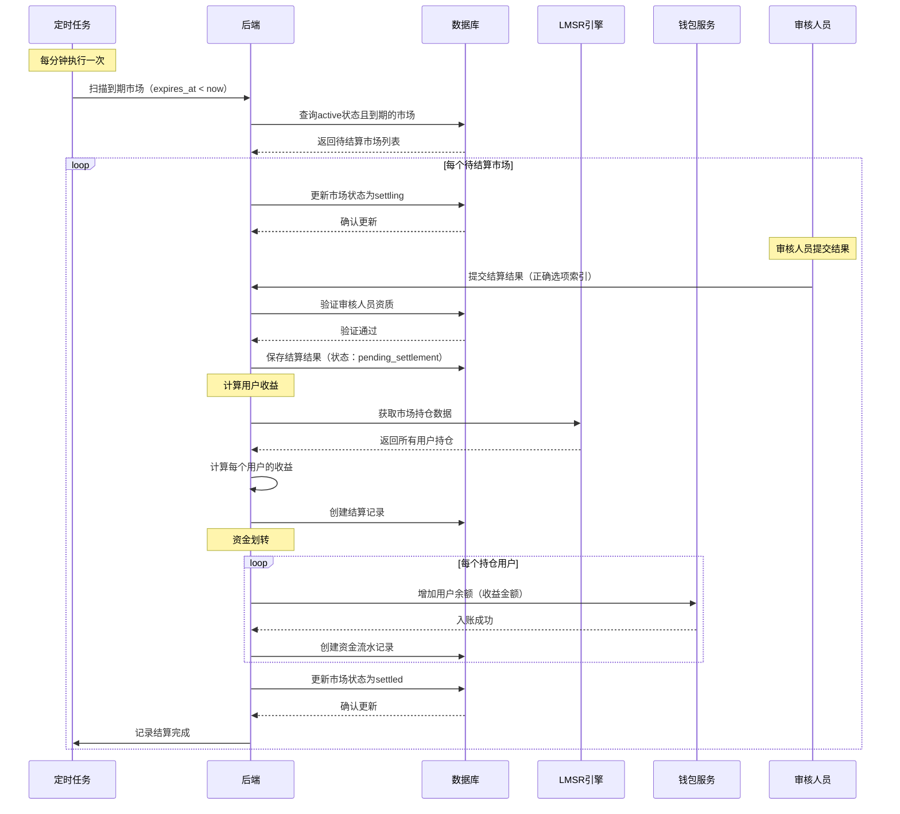
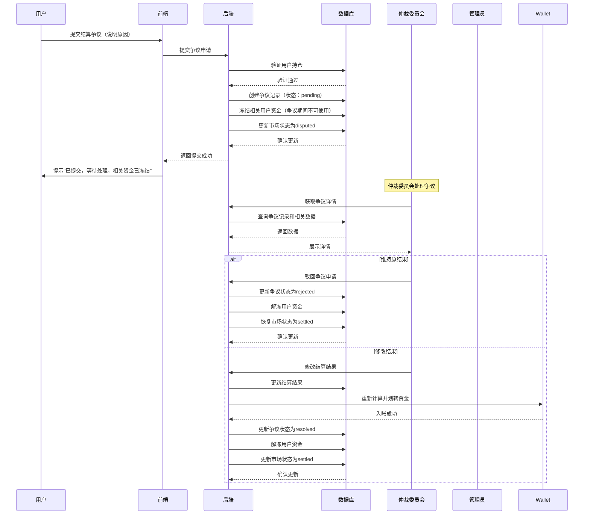

# 到期结算核心模块 PRD

## 一、模块概述

### 1.1 模块核心定位与业务价值
到期结算核心模块负责预测市场到期后的结果判定、资金结算、收益分配，是平台交易闭环的关键环节。该模块直接关系到用户的资金安全和平台公信力，必须确保结算准确、及时、透明。结算的准确性是平台长期发展的基石。

### 1.2 模块所属项目阶段
Phase1 MVP（10-14周，越南首发）

### 1.3 模块与其他系统模块的关联关系
- **上游依赖**：话题与市场管理模块（市场到期信息）、LMSR交易引擎模块（持仓数据）
- **下游依赖**：钱包与充值支付模块（资金划转）、纯知识币商城模块（余额可用）
- **平行依赖**：运营后台核心模块（结算数据）、内容风控基础模块（争议处理）

### 1.4 模块合规红线与技术约束
**合规红线：**
1. 结算结果必须基于客观事实，禁止人为操纵
2. 结算过程必须透明可追溯，所有操作留痕
3. 用户收益必须全额发放，禁止克扣或延迟
4. 争议处理必须公平公正，有明确申诉渠道

**技术约束：**
1. 技术栈：Python FastAPI + PostgreSQL 16 + Redis 7
2. 架构原则：CQRS读写分离，结算操作强一致性
3. 定时任务：使用Celery + Redis实现定时结算
4. 数据一致性：关键资金操作必须使用数据库事务

## 二、角色与权限

### 2.1 该模块涉及的用户角色
| 角色 | 权限边界 |
|------|----------|
| 普通用户 | 查看自己持仓的结算状态、查看结算结果、查看收益明细 |
| 市场创建者 | 提交市场结果建议、查看自己创建市场的结算数据 |
| 审核人员 | 审核市场结果、处理结算争议 |
| 管理员 | 强制结算、调整结算结果、处理异常结算 |
| 运营人员 | 查看结算统计报表、导出结算数据 |
| 财务人员 | 查看资金结算报表、核对结算金额 |

### 2.2 各角色在该模块的操作权限边界
- **普通用户**：只读权限，查看自己的结算信息
- **市场创建者**：可提交结果建议，但需审核确认
- **审核人员**：只能审核结果，无法修改结算金额
- **管理员**：拥有最高权限，但关键操作需二次确认
- **运营/财务**：只读权限为主，无操作权限

## 三、功能范围与优先级

### 3.1 核心功能清单（P0必须实现，MVP必做）
1. 市场到期自动检测
2. 结算结果提交与审核
3. 用户收益计算
4. 资金自动划转
5. 结算记录查询
6. 结算状态管理（待结算/结算中/已结算/争议中）
7. 基础争议处理流程
8. 结算通知推送
9. 结算数据对账
10. 异常结算告警

### 3.2 次要功能清单（P1迭代实现，MVP不做）
1. 结算结果公示
2. 用户申诉流程
3. 结算数据分析看板
4. 批量结算功能
5. 结算历史记录导出

### 3.3 未来扩展功能清单（P2及以后实现）
1. 第三方数据源自动验证
2. AI辅助结果判定
3. 社区投票判定机制
4. 结算保险基金

### 3.4 明确MVP阶段不做的功能边界
- 不支持用户申诉流程（仅管理员处理争议）
- 不支持结算结果公示
- 不支持第三方数据源自动验证
- 不支持批量结算（逐市场结算）
- 不支持结算历史记录导出

## 四、业务流程与逻辑

### 4.1 核心业务主流程

#### 4.1.1 市场到期自动结算流程


#### 4.1.2 争议处理流程


### 4.2 详细业务规则

#### 4.2.1 结算触发规则
- **自动检测**：每分钟执行一次定时任务，扫描到期市场
- **到期判定**：expires_at < 当前时间
- **结算窗口**：到期后24小时内完成结算
- **延迟处理**：超过24小时未结算，自动告警

#### 4.2.2 结果提交规则
- **提交人**：市场创建者或审核人员
- **提交格式**：结果选项索引（0-based）
- **提交时效**：市场到期后12小时内
- **超时处理**：管理员介入处理

#### 4.2.3 收益计算规则
- **正确选项**：持有该选项份额的用户获得收益
- **收益公式**：`收益 = 持有份额 × 100% / 正确选项总份额 × 市场总资金`
- **错误选项**：持有错误选项份额归零
- **平台抽成**：Phase1不抽成（100%返还）

#### 4.2.4 资金划转规则
- **划转时机**：结算结果审核通过后立即执行
- **划转方式**：批量处理，逐用户入账
- **入账通知**：每笔入账创建资金流水记录
- **失败处理**：单个用户失败不影响其他用户，失败记录告警

#### 4.2.5 结算状态流转规则
```
active（进行中） → expired（已到期） → settling（结算中） → settled（已结算）
                                              ↓
                                         disputed（争议中） → settled（已结算）
```

#### 4.2.6 争议处理SOP
- **争议提交**：用户可在结算完成后7天内提交争议
- **资金冻结**：争议提交后立即冻结相关用户在该市场的所有资金
- **仲裁机制**：由3人仲裁委员会处理，需2/3同意才能改变结果
- **处理SLA**：争议必须在48小时内处理完成
- **解冻规则**：争议处理完成后立即解冻资金
- **申诉机制**：对仲裁结果不满可向高级管理员申诉（仅限重大争议）

### 4.3 异常场景处理方案

#### 4.3.1 结算结果争议
- **用户异议**：提交争议申请，启动多方仲裁机制
- **结果错误**：仲裁委员会修正结果，重新计算收益
- **资金追回**：错误发放的资金从后续收益中扣除
- **资金冻结**：争议期间相关资金完全冻结，不可交易或兑换

#### 4.3.2 系统异常
- **定时任务失败**：自动重试（3次），失败后告警
- **资金划转失败**：记录失败原因，人工介入处理
- **数据库异常**：事务回滚，保证数据一致性
- **仲裁系统异常**：降级为管理员仲裁，但需记录降级原因

#### 4.3.3 数据异常
- **持仓数据不一致**：暂停结算，人工核对修复
- **结算金额异常**：自动告警，人工审核
- **重复结算**：幂等性校验，防止重复入账
- **争议数据丢失**：从备份恢复，确保争议处理连续性

## 五、前端页面与交互要求

### 5.1 页面清单与原型跳转逻辑
1. **结算列表页**：展示所有待结算/已结算市场
2. **结算详情页**：展示市场结算详情、结果、收益分配
3. **我的结算页**：展示用户自己的结算记录和收益
4. **结果提交页**：审核人员/创建者提交结算结果
5. **争议处理页**：管理员处理结算争议
6. **结算统计页**：运营人员查看结算数据报表

### 5.2 核心页面元素与交互规则
- **结算状态标签**：清晰标识结算状态（待结算/结算中/已结算/争议中）
- **结果展示区**：高亮显示正确选项，展示各选项概率
- **收益明细表**：展示每个用户的持仓、收益计算过程
- **争议提交表单**：争议原因输入、证据上传
- **结算时间线**：展示结算关键节点时间

### 5.3 多语言适配要求
- 支持越南语、英语
- 金额格式按当地习惯（越南：1.000.000 VND）
- 日期时间格式：DD/MM/YYYY HH:mm
- 状态文案本地化翻译

### 5.4 响应式适配要求
- 适配手机竖屏（320px-414px）
- 收益明细表在小屏幕上支持横向滑动
- 结算状态标签固定位置，便于快速识别
- 争议表单分步展示

## 六、数据模型与接口要求

### 6.1 核心数据实体与字段要求

#### 6.1.1 市场结算表 (market_settlements)
| 字段名 | 类型 | 必填 | 描述 |
|--------|------|------|------|
| id | UUID | 是 | 结算ID |
| market_id | UUID | 是 | 市场ID |
| winning_outcome_index | INT | 是 | 正确结果索引 |
| total_pool | BIGINT | 是 | 市场总资金池（知识币） |
| total_shares_winning | BIGINT | 是 | 正确选项总份额 |
| status | VARCHAR(20) | 是 | 结算状态（pending/settling/settled/disputed） |
| settled_at | TIMESTAMP | 是 | 结算完成时间 |
| settled_by | UUID | 是 | 结算操作人ID |
| created_at | TIMESTAMP | 是 | 创建时间 |
| updated_at | TIMESTAMP | 是 | 更新时间 |

#### 6.1.2 用户结算记录表 (user_settlements)
| 字段名 | 类型 | 必填 | 描述 |
|--------|------|------|------|
| id | UUID | 是 | 用户结算ID |
| settlement_id | UUID | 是 | 结算ID |
| user_id | UUID | 是 | 用户ID |
| outcome_index | INT | 是 | 持有结果索引 |
| shares | BIGINT | 是 | 持有份额 |
| payout | BIGINT | 是 | 收益金额（知识币） |
| status | VARCHAR(20) | 是 | 状态（pending/paid/failed） |
| paid_at | TIMESTAMP | 否 | 支付时间 |
| created_at | TIMESTAMP | 是 | 创建时间 |

#### 6.1.3 结算争议表 (settlement_disputes)
| 字段名 | 类型 | 必填 | 描述 |
|--------|------|------|------|
| id | UUID | 是 | 争议ID |
| settlement_id | UUID | 是 | 结算ID |
| user_id | UUID | 是 | 提交用户ID |
| reason | TEXT | 是 | 争议原因 |
| evidence | JSONB | 否 | 证据材料 |
| status | VARCHAR(20) | 是 | 状态（pending/resolved/rejected） |
| resolved_by | UUID | 否 | 处理人ID |
| resolved_at | TIMESTAMP | 否 | 处理时间 |
| resolution | TEXT | 否 | 处理结果说明 |
| created_at | TIMESTAMP | 是 | 创建时间 |

### 6.2 核心接口清单与入参/出参核心要求

#### 6.2.1 获取待结算市场列表
- **URL**: GET /api/v1/settlements/pending
- **入参**: page=1, limit=20
- **出参**: 
  ```json
  {
    "settlements": [
      {
        "settlement_id": "uuid",
        "market_id": "uuid",
        "market_title": "AI将取代多少工作岗位？",
        "expires_at": "2026-03-26T00:00:00Z",
        "status": "pending",
        "total_pool": 100000
      }
    ],
    "total": 5,
    "page": 1,
    "limit": 20
  }
  ```

#### 6.2.2 提交结算结果
- **URL**: POST /api/v1/settlements/{settlement_id}/result
- **入参**: 
  ```json
  {
    "winning_outcome_index": 1
  }
  ```
- **出参**: 
  ```json
  {
    "settlement_id": "uuid",
    "status": "settling"
  }
  ```

#### 6.2.3 执行结算
- **URL**: POST /api/v1/settlements/{settlement_id}/execute
- **入参**: 无
- **出参**: 
  ```json
  {
    "settlement_id": "uuid",
    "status": "settled",
    "users_paid": 50,
    "total_payout": 95000
  }
  ```

#### 6.2.4 获取用户结算记录
- **URL**: GET /api/v1/settlements/user
- **入参**: page=1, limit=20
- **出参**: 
  ```json
  {
    "settlements": [
      {
        "settlement_id": "uuid",
        "market_title": "AI将取代多少工作岗位？",
        "outcome_index": 1,
        "shares": 100,
        "payout": 2000,
        "status": "paid",
        "paid_at": "2026-03-26T12:00:00Z"
      }
    ],
    "total": 10,
    "page": 1,
    "limit": 20
  }
  ```

#### 6.2.5 提交结算争议
- **URL**: POST /api/v1/settlements/{settlement_id}/dispute
- **入参**: 
  ```json
  {
    "reason": "结果判定有误，实际应为选项2",
    "evidence": ["url1", "url2"]
  }
  ```
- **出参**: 
  ```json
  {
    "dispute_id": "uuid",
    "status": "pending"
  }
  ```

#### 6.2.6 处理争议
- **URL**: POST /api/v1/settlements/disputes/{dispute_id}/resolve
- **入参**: 
  ```json
  {
    "action": "uphold",
    "resolution": "维持原结果"
  }
  ```
- **出参**: 
  ```json
  {
    "dispute_id": "uuid",
    "status": "resolved"
  }
  ```

### 6.3 数据读写性能要求
- 待结算列表查询：< 200ms (P95)
- 结算执行：< 500ms per user (P95)
- 用户结算记录查询：< 200ms (P95)
- 并发支持：10 TPS（结算为低频操作）

### 6.4 数据存储与归档要求
- 结算记录：永久存储
- 争议记录：永久存储
- 操作日志：保留180天
- 敏感数据：无需特殊加密

## 七、非功能需求

### 7.1 性能指标
- 接口响应时间：< 300ms (P95)
- 结算执行速度：100用户/分钟
- 页面加载时长：首屏 < 2s

### 7.2 可用性要求
- 服务可用性SLA：99.9%
- 故障降级策略：
  - 定时任务失败：自动重试 + 人工告警
  - 钱包服务不可用：暂停结算，等待恢复
  - 数据库异常：事务回滚，保证一致性

### 7.3 可扩展性要求
- 结算规则可配置化
- 支持批量结算优化
- 预留第三方数据源接入接口

### 7.4 兼容性要求
- 浏览器：Chrome、Safari、Firefox最新2个版本
- 设备：iOS 12+、Android 8+
- 语言：越南语、英语

### 7.5 监控告警指标
**核心业务指标监控：**
- **结算及时率**：阈值 > 95%（低于95%触发告警）
- **结算争议率**：阈值 < 2%（超过2%触发告警）  
- **资金划转成功率**：阈值 > 99.9%（低于99.9%触发告警）
- **平均结算延迟**：阈值 < 30分钟（超过30分钟触发告警）
- **定时任务执行失败率**：阈值 < 1%（超过1%触发告警）

**系统性能监控：**
- **结算API响应时间**：P95 < 500ms（超过500ms触发告警）
- **数据库连接池使用率**：< 80%（超过80%触发告警）
- **Redis缓存命中率**：> 90%（低于90%触发告警）
- **内存使用率**：< 85%（超过85%触发告警）

**告警通知机制：**
- CRITICAL级别：短信 + 邮件 + 企业微信
- ERROR级别：邮件 + 企业微信
- WARNING级别：企业微信
- INFO级别：日志记录

## 八、安全与合规要求

### 8.1 接口权限控制要求
- 所有结算操作接口需要JWT Token认证
- 结果提交需要审核人员或管理员权限
- 争议处理需要管理员权限
- 用户只能查看自己的结算记录

### 8.2 数据加密与脱敏要求
- 结算数据无需特殊加密
- 用户ID在日志中部分脱敏
- 敏感操作记录完整审计日志

### 8.3 操作审计日志要求
- 记录所有结算操作
- 包含操作人、操作时间、操作类型、操作详情
- 日志保留180天，支持按市场ID、用户ID、时间范围查询

### 8.4 合规校验规则与拦截逻辑
- 结算结果必须经过审核确认
- 争议处理必须管理员介入
- 资金划转必须双人复核（系统 + 人工）
- 异常结算金额自动告警

### 8.5 防刷、防并发、防篡改要求
- 防重复结算：幂等性校验（settlement_id + user_id唯一）
- 防并发冲突：数据库行级锁 + 事务
- 防篡改：HTTPS传输 + 请求签名验证
- 防操纵：结果提交和审核分离

## 九、埋点与数据分析要求

### 9.1 核心埋点事件清单
- settlement_view: 结算列表页访问
- settlement_detail_view: 结算详情页访问
- result_submit: 提交结算结果
- settlement_execute: 执行结算
- dispute_submit: 提交争议
- dispute_resolve: 处理争议

### 9.2 核心数据指标定义
- 结算及时率 = 24小时内完成结算数 / 总结算数
- 结算争议率 = 争议结算数 / 总结算数
- 平均结算时长 = 总结算时长 / 总结算数
- 用户收益总额 = 所有用户收益之和

### 9.3 数据统计与看板要求
- 结算效率监控看板
- 争议处理统计
- 用户收益分布分析
- 异常结算告警

## 十、验收标准

### 10.1 功能验收标准
- [ ] 市场到期后自动触发结算流程
- [ ] 审核人员可正常提交结算结果
- [ ] 用户收益计算准确
- [ ] 资金自动划转到用户钱包
- [ ] 结算记录完整保存
- [ ] 争议提交流程正常
- [ ] 管理员可正常处理争议
- [ ] 结算状态正确流转

### 10.2 性能验收标准
- [ ] 待结算列表查询响应时间 < 200ms (P95)
- [ ] 结算执行速度 > 100用户/分钟
- [ ] 系统支持10 TPS并发结算操作
- [ ] 页面首屏加载时间 < 2s

### 10.3 安全合规验收标准
- [ ] 通过第三方安全扫描（无高危漏洞）
- [ ] 结算结果审核流程100%执行
- [ ] 所有结算操作都有完整审计日志
- [ ] 资金划转准确无误
- [ ] 争议处理流程公正透明

### 10.4 兼容性验收标准
- [ ] 在iOS和Android主流机型上正常运行
- [ ] 越南语和英语界面显示正确
- [ ] 在Chrome、Safari、Firefox浏览器上功能正常

## 十一、附件

### 11.1 产品原型图
- 结算列表页原型
- 结算详情页原型
- 我的结算页原型
- 争议处理页原型

### 11.2 流程图/时序图
- 市场到期自动结算流程时序图（见4.1.1）
- 争议处理流程时序图（见4.1.2）
- 结算状态流转图

### 11.3 相关合规文件/参考资料
- 越南Decree 06/2017/ND-CP博彩管制条例摘要
- 预测市场结算最佳实践指南
- 资金结算安全规范

### 11.4 版本变更记录
| 版本 | 日期 | 修改内容 | 修改人 |
|------|------|----------|--------|
| v1.0 | 2026-02-26 | 初稿 | 产品经理 |