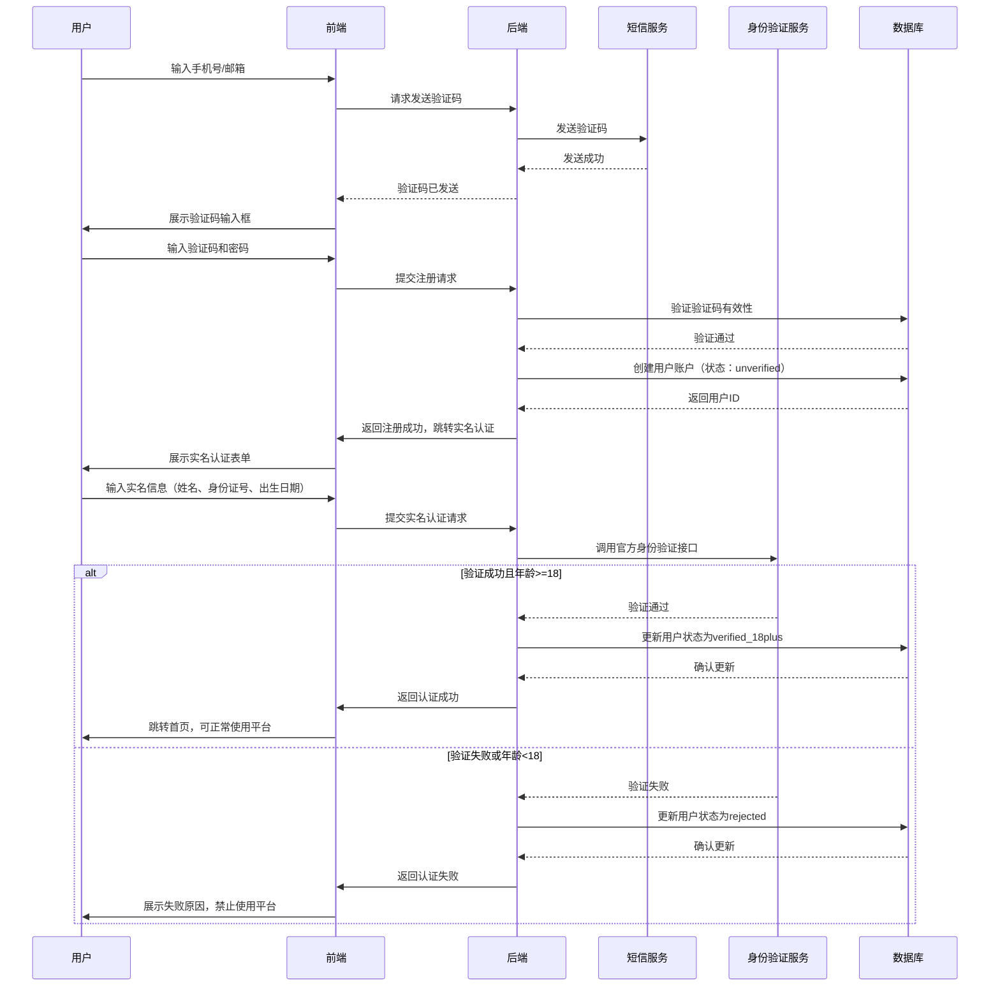
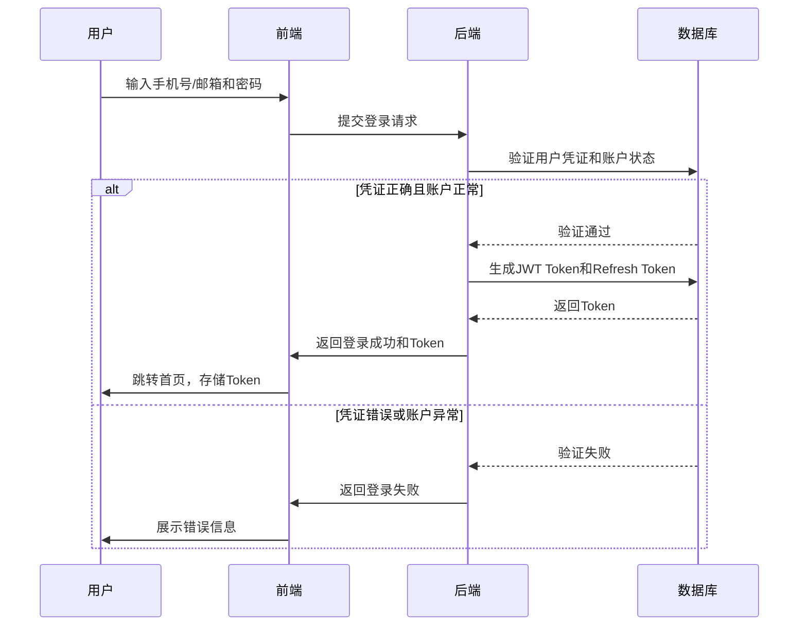

# 用户与权限体系模块 PRD

## 一、模块概述

### 1.1 模块核心定位与业务价值
用户与权限体系模块是平台的基础身份认证和访问控制中心，负责处理用户注册、实名认证、角色权限管理等核心功能。该模块直接关系到平台的合规性和安全性，是MVP阶段必须优先实现的基础模块。

### 1.2 模块所属项目阶段
Phase1 MVP（10-14周，越南首发）

### 1.3 模块与其他系统模块的关联关系
- **上游依赖**：无（基础模块）
- **下游依赖**：所有其他模块（钱包、交易、商城、运营后台等）
- **平行依赖**：内容风控基础模块（用户行为监控）

### 1.4 模块合规红线与技术约束
**合规红线：**
1. 必须落地18+实名注册，未满18岁用户禁止注册和使用
2. 实名信息必须通过当地官方验证接口验证
3. 多语言用户协议必须明确虚拟积分非金融产品
4. 所有用户操作必须保留完整审计日志

**技术约束：**
1. 技术栈：Python FastAPI + PostgreSQL 16 + Redis 7
2. 认证方式：JWT Token + Refresh Token
3. 密码安全：bcrypt加密，支持多因素认证
4. 架构原则：单体应用起步，CQRS读写分离

## 二、角色与权限

### 2.1 该模块涉及的用户角色
| 角色 | 权限边界 |
|------|----------|
| 普通用户 | 注册、登录、实名认证、修改个人信息、查看自己的操作记录 |
| 管理员 | 用户管理、角色管理、权限配置、操作审计、系统配置 |
| 运营人员 | 用户数据查询、用户行为分析、导出用户统计报表 |
| 审核人员 | 实名认证审核、违规用户处理、用户申诉处理 |
| 财务人员 | 用户资金相关查询（需额外授权） |

### 2.2 各角色在该模块的操作权限边界
- **普通用户**：只能操作自己的账户信息，无法查看他人信息
- **管理员**：拥有全部用户管理权限，但敏感操作需二次确认
- **运营/审核/财务**：只读权限为主，无账户修改权限

## 三、功能范围与优先级

### 3.1 核心功能清单（P0必须实现，MVP必做）
1. 用户注册（手机号/邮箱）
2. 用户登录/登出
3. 18+实名认证
4. 密码管理（修改、重置）
5. 多因素认证（短信验证码）
6. 用户角色与权限管理
7. 用户信息管理
8. 操作审计日志
9. 用户协议多语言版本
10. 账户安全设置（登录设备管理）

### 3.2 次要功能清单（P1迭代实现，MVP不做）
1. 社交账号登录（Google、Facebook）
2. 生物识别认证（指纹、面部识别）
3. 用户等级体系
4. 用户标签管理
5. 自动化用户分群

### 3.3 未来扩展功能清单（P2及以后实现）
1. 企业账户支持
2. SSO单点登录
3. OAuth2.0授权
4. 用户行为画像
5. 智能风控拦截

### 3.4 明确MVP阶段不做的功能边界
- 不支持社交账号登录
- 不支持生物识别认证
- 不支持用户等级和积分体系
- 不支持自动化用户分群
- 不支持企业账户

## 四、业务流程与逻辑

### 4.1 核心业务主流程

#### 4.1.1 用户注册与实名认证主流程


#### 4.1.2 用户登录主流程


### 4.2 详细业务规则

#### 4.2.1 注册规则
- 支持手机号和邮箱两种注册方式
- 手机号必须通过短信验证码验证
- 邮箱必须通过邮件验证码验证
- 密码强度要求：8-20位，包含大小写字母和数字
- 同一手机号/邮箱只能注册一个账户

#### 4.2.2 实名认证规则
- 必须提供真实姓名、身份证号、出生日期
- 身份证号必须通过当地官方验证接口
- 出生日期计算年龄必须 >= 18岁
- 实名认证失败后可重新提交，最多3次/天
- 实名认证通过后不可修改关键信息

#### 4.2.3 登录规则
- 支持手机号/邮箱 + 密码登录
- 支持短信验证码登录（免密码）
- 连续5次登录失败后锁定账户30分钟
- JWT Token有效期：2小时
- Refresh Token有效期：7天

#### 4.2.4 权限规则
- **普通用户**：基础操作权限（充值、交易、兑换）
- **管理员**：全系统管理权限
- **运营人员**：数据查询和分析权限
- **审核人员**：内容和用户审核权限
- **财务人员**：资金相关查询权限

### 4.3 异常场景处理方案

#### 4.3.1 网络异常
- **注册/登录超时**：前端显示友好错误，提供重试选项
- **身份验证服务不可用**：降级为人工审核，延长认证时间
- **短信服务不可用**：提供备用验证方式（邮箱验证码）

#### 4.3.2 并发冲突
- 使用数据库唯一约束防止重复注册
- 用户状态变更使用乐观锁防止并发修改
- Token刷新使用分布式锁防止并发刷新

#### 4.3.3 数据异常
- 身份证号格式错误：前端实时校验，后端二次验证
- 年龄计算错误：使用标准日期计算，避免时区问题
- Token泄露：支持主动注销所有设备

#### 4.3.4 安全异常
- 异常登录地点：触发二次验证或账户锁定
- 高频注册/登录：IP限流，行为分析拦截
- 密码泄露：定期检查已知泄露密码库

### 4.3.5 跨模块数据一致性异常
- 用户状态变更与钱包初始化不一致：定时对账任务检测并修复
- 实名认证状态与交易权限不一致：实时校验，阻断异常操作
- 账户冻结状态与各模块状态不同步：事件驱动同步机制

## 五、前端页面与交互要求

### 5.1 页面清单与原型跳转逻辑
1. **注册页面**：手机号/邮箱输入、验证码获取、密码设置
2. **实名认证页面**：姓名、身份证号、出生日期输入、证件上传
3. **登录页面**：手机号/邮箱、密码输入、验证码登录选项
4. **个人资料页面**：基本信息展示、安全设置、协议查看
5. **账户安全页面**：登录设备管理、密码修改、多因素认证设置
6. **用户协议页面**：多语言用户协议展示、同意确认

### 5.2 核心页面元素与交互规则
- **验证码倒计时**：60秒倒计时，防止频繁请求
- **密码强度提示**：实时显示密码强度
- **身份证号输入**：自动格式化（XXX XXXX XXXX XXXX）
- **出生日期选择**：日期选择器，限制可选范围（18-100岁）
- **协议同意勾选**：必须勾选才能继续

### 5.3 多语言适配要求
- 支持越南语、英语
- 用户协议多语言版本
- 错误提示信息多语言
- 日期格式：DD/MM/YYYY

### 5.4 响应式适配要求
- 适配手机竖屏（320px-414px）
- 表单字段垂直排列，便于输入
- 验证码按钮固定位置，避免键盘遮挡
- 错误提示紧邻相关字段

## 六、数据模型与接口要求

### 6.1 核心数据实体与字段要求

#### 6.1.1 用户表 (users)
| 字段名 | 类型 | 必填 | 描述 |
|--------|------|------|------|
| id | UUID | 是 | 用户ID |
| phone | VARCHAR(20) | 否 | 手机号（加密存储） |
| email | VARCHAR(255) | 否 | 邮箱 |
| password_hash | VARCHAR(255) | 是 | 密码哈希 |
| full_name | VARCHAR(100) | 否 | 真实姓名（实名后） |
| id_number | VARCHAR(50) | 否 | 身份证号（加密存储） |
| birth_date | DATE | 否 | 出生日期 |
| age | INT | 否 | 年龄（计算字段） |
| status | VARCHAR(20) | 是 | 状态（pending/unverified/verified_18plus/rejected/banned） |
| role | VARCHAR(20) | 是 | 角色（user/admin/operation/auditor/finance） |
| created_at | TIMESTAMP | 是 | 创建时间 |
| updated_at | TIMESTAMP | 是 | 更新时间 |
| last_login_at | TIMESTAMP | 否 | 最后登录时间 |

#### 6.1.2 用户认证表 (user_authentications)
| 字段名 | 类型 | 必填 | 描述 |
|--------|------|------|------|
| user_id | UUID | 是 | 用户ID |
| auth_type | VARCHAR(20) | 是 | 认证类型（phone/email） |
| identifier | VARCHAR(255) | 是 | 标识符（手机号/邮箱） |
| verified | BOOLEAN | 是 | 是否已验证 |
| verified_at | TIMESTAMP | 否 | 验证时间 |
| created_at | TIMESTAMP | 是 | 创建时间 |

#### 6.1.3 用户会话表 (user_sessions)
| 字段名 | 类型 | 必填 | 描述 |
|--------|------|------|------|
| id | UUID | 是 | 会话ID |
| user_id | UUID | 是 | 用户ID |
| token | VARCHAR(500) | 是 | JWT Token |
| refresh_token | VARCHAR(500) | 是 | Refresh Token |
| device_info | JSONB | 是 | 设备信息（IP、UA、地理位置） |
| expires_at | TIMESTAMP | 是 | 过期时间 |
| created_at | TIMESTAMP | 是 | 创建时间 |

#### 6.1.4 操作日志表 (audit_logs)
| 字段名 | 类型 | 必填 | 描述 |
|--------|------|------|------|
| id | UUID | 是 | 日志ID |
| user_id | UUID | 是 | 用户ID |
| action | VARCHAR(100) | 是 | 操作类型（login/register/verify/update等） |
| details | JSONB | 是 | 操作详情 |
| ip_address | VARCHAR(45) | 是 | IP地址 |
| user_agent | TEXT | 是 | 用户代理 |
| created_at | TIMESTAMP | 是 | 创建时间 |

### 6.2 核心接口清单与入参/出参核心要求

#### 6.2.1 用户注册
- **URL**: POST /api/v1/auth/register
- **入参**: 
  ```json
  {
    "identifier": "user@example.com",
    "password": "SecurePass123",
    "verification_code": "123456"
  }
  ```
- **出参**: 
  ```json
  {
    "user_id": "uuid",
    "status": "unverified",
    "next_step": "identity_verification"
  }
  ```

#### 6.2.2 实名认证
- **URL**: POST /api/v1/auth/verify-identity
- **入参**: 
  ```json
  {
    "full_name": "Nguyen Van A",
    "id_number": "123456789012",
    "birth_date": "2000-01-01"
  }
  ```
- **出参**: 
  ```json
  {
    "status": "verified_18plus",
    "age": 26,
    "message": "认证成功"
  }
  ```

#### 6.2.3 用户登录
- **URL**: POST /api/v1/auth/login
- **入参**: 
  ```json
  {
    "identifier": "user@example.com",
    "password": "SecurePass123"
  }
  ```
- **出参**: 
  ```json
  {
    "token": "jwt_token",
    "refresh_token": "refresh_token",
    "expires_in": 7200,
    "user": {
      "id": "uuid",
      "role": "user",
      "status": "verified_18plus"
    }
  }
  ```

#### 6.2.4 获取用户信息
- **URL**: GET /api/v1/users/me
- **入参**: 无
- **出参**: 
  ```json
  {
    "user": {
      "id": "uuid",
      "phone": "138****1234",
      "email": "user@example.com",
      "full_name": "Nguyen Van A",
      "age": 26,
      "status": "verified_18plus",
      "role": "user",
      "created_at": "2026-02-26T00:00:00Z"
    }
  }
  ```

#### 6.2.5 修改密码
- **URL**: PUT /api/v1/users/me/password
- **入参**: 
  ```json
  {
    "old_password": "OldPass123",
    "new_password": "NewPass123"
  }
  ```
- **出参**: 
  ```json
  {
    "message": "密码修改成功"
  }
  ```

### 6.3 数据读写性能要求
- 用户注册：< 300ms (P95)
- 用户登录：< 200ms (P95)
- 实名认证：< 1000ms (P95，含外部接口调用）
- 用户信息查询：< 100ms (P95)
- 并发支持：100 TPS

### 6.4 数据存储与归档要求
- 用户数据：永久存储
- 操作日志：保留180天
- 敏感数据：加密存储（AES-256）
- Token数据：按过期时间自动清理

## 七、非功能需求

### 7.1 性能指标
- 接口响应时间：< 300ms (P95)
- 并发量支持：1000+ 用户在线，100 TPS
- 页面加载时长：首屏 < 1.5s

### 7.2 可用性要求
- 服务可用性SLA：99.9%
- 故障降级策略：
  - 身份验证服务不可用：降级为人工审核
  - 短信服务不可用：提供邮箱验证码备用
  - 数据库只读：允许登录，禁止注册和修改

### 7.3 可扩展性要求
- 认证方式插件化设计，便于后续扩展
- 权限体系RBAC设计，支持细粒度权限控制
- 多租户架构预留，支持未来企业版

### 7.4 兼容性要求
- 浏览器：Chrome、Safari、Firefox最新2个版本
- 设备：iOS 12+、Android 8+
- 语言：越南语、英语

### 7.5 监控告警指标
- **核心业务指标**：
  - 注册成功率：> 95%（阈值：90%）
  - 实名认证通过率：> 85%（阈值：80%）
  - 登录成功率：> 98%（阈值：95%）
  - 账户活跃度：日活用户占比 > 20%（阈值：15%）

- **系统性能指标**：
  - API错误率：< 1%（阈值：2%）
  - 数据库查询延迟：< 100ms（阈值：200ms）
  - Redis缓存命中率：> 90%（阈值：85%）
  - JWT Token刷新成功率：> 99%（阈值：95%）

- **安全监控指标**：
  - 异常登录尝试：> 5次/分钟/用户（阈值：立即告警）
  - 账户锁定事件：> 10次/小时（阈值：立即告警）
  - 密码泄露检测：发现已知泄露密码（阈值：立即告警）
  - 跨地域异常登录：同一账户1小时内跨大洲登录（阈值：立即告警）

- **告警规则**：
  - P0告警（立即通知）：安全相关指标、核心业务指标低于阈值
  - P1告警（30分钟内处理）：系统性能指标异常、业务指标趋势恶化
  - P2告警（24小时内处理）：非关键指标异常、容量预警

## 八、安全与合规要求

### 8.1 接口权限控制要求
- 所有用户信息接口需要JWT Token认证
- 敏感操作（密码修改、实名认证）需要二次验证
- 管理员接口需要额外的角色权限校验

### 8.2 数据加密与脱敏要求
- 密码：bcrypt哈希存储
- 手机号/身份证号：AES-256加密存储
- API响应中的敏感信息：部分脱敏（如手机号显示为138****1234）

### 8.3 操作审计日志要求
- 记录所有关键用户操作
- 包含操作人、操作时间、操作类型、操作详情、IP地址
- 日志保留180天，支持按用户ID、操作类型、时间范围查询

### 8.4 合规校验规则与拦截逻辑
- 18+年龄验证100%准确
- 实名信息官方验证
- 用户协议多语言版本
- 异常登录行为监控

### 8.5 防刷、防并发、防篡改要求
- 防重复注册：手机号/邮箱唯一约束
- 防暴力破解：登录失败锁定机制
- 防会话劫持：HTTPS传输 + Token绑定设备
- 防信息泄露：敏感数据加密 + 访问控制

## 九、埋点与数据分析要求

### 9.1 核心埋点事件清单
- register_start: 开始注册流程
- register_success: 注册成功
- identity_verify_start: 开始实名认证
- identity_verify_success: 实名认证成功
- login_success: 登录成功
- password_change: 密码修改
- account_view: 账户信息查看

### 9.2 核心数据指标定义
- 注册转化率 = 成功注册用户数 / 开始注册用户数
- 实名认证通过率 = 认证成功用户数 / 提交认证用户数
- 登录成功率 = 成功登录次数 / 登录尝试次数
- 账户活跃度 = 日活跃用户数 / 总注册用户数

### 9.3 数据统计与看板要求
- 实时注册监控看板
- 实名认证通过率分析
- 用户地域分布统计
- 异常登录告警

## 十、验收标准

### 10.1 功能验收标准
- [ ] 用户可正常注册和登录
- [ ] 18+实名认证流程完整，年龄验证准确
- [ ] 未满18岁用户无法通过认证
- [ ] 密码管理功能正常（修改、重置）
- [ ] 多因素认证正常工作
- [ ] 用户角色权限控制准确
- [ ] 操作审计日志完整记录
- [ ] 多语言用户协议正确展示

### 10.2 性能验收标准
- [ ] 用户注册响应时间 < 300ms (P95)
- [ ] 用户登录响应时间 < 200ms (P95)
- [ ] 系统支持100 TPS并发注册/登录
- [ ] 页面首屏加载时间 < 1.5s

### 10.3 安全合规验收标准
- [ ] 通过第三方安全扫描（无高危漏洞）
- [ ] 18+年龄验证100%准确
- [ ] 敏感数据加密存储
- [ ] 所有关键操作都有完整审计日志
- [ ] 防暴力破解机制有效

### 10.4 兼容性验收标准
- [ ] 在iOS和Android主流机型上正常运行
- [ ] 越南语和英语界面显示正确
- [ ] 在Chrome、Safari、Firefox浏览器上功能正常

## 十一、附件

### 11.1 产品原型图
- 注册流程原型
- 实名认证页面原型
- 登录页面原型
- 个人资料页面原型

### 11.2 流程图/时序图
- 用户注册与实名认证主流程时序图（见4.1.1）
- 用户登录主流程时序图（见4.1.2）
- 权限控制流程图

### 11.3 相关合规文件/参考资料
- 越南Decree 06/2017/ND-CP博彩管制条例摘要
- 越南个人信息保护相关法规
- GDPR/CCPA合规指南（国际化参考）

### 11.4 版本变更记录
| 版本 | 日期 | 修改内容 | 修改人 |
|------|------|----------|--------|
| v1.0 | 2026-02-26 | 初稿 | 产品经理 |