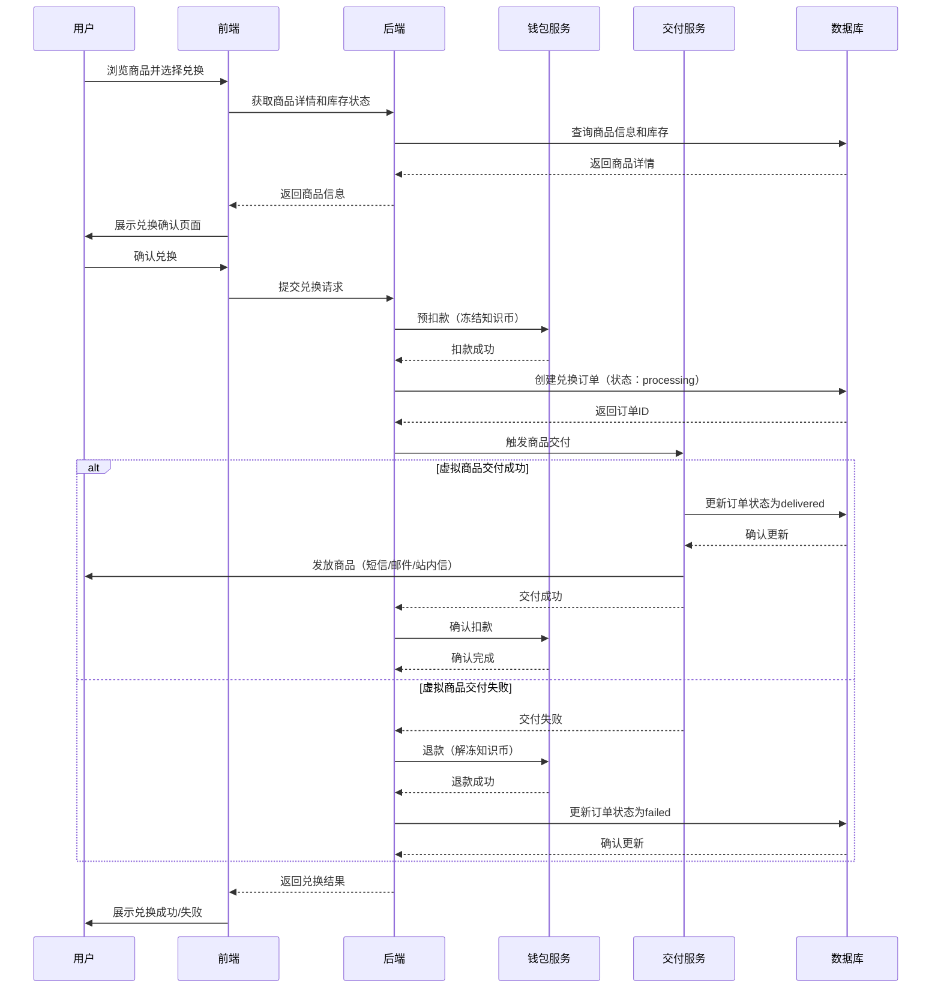

# 纯知识币商城模块 PRD

## 一、模块概述

### 1.1 模块核心定位与业务价值
纯知识币商城模块是平台的知识变现出口，用户可使用知识币兑换各类商品和服务，实现知识价值的闭环。该模块直接关系到用户留存和平台商业价值，是MVP阶段必须实现的核心模块。

### 1.2 模块所属项目阶段
Phase1 MVP（10-14周，越南首发）

### 1.3 模块与其他系统模块的关联关系
- **上游依赖**：钱包与充值支付模块（知识币余额）、用户与权限体系模块（用户身份）
- **下游依赖**：运营后台核心模块（商品管理）、内容风控基础模块（商品审核）
- **平行依赖**：LMSR交易引擎模块（知识币来源）

### 1.4 模块合规红线与技术约束
**合规红线：**
1. 商品仅支持知识币兑换，禁止任何形式的现金交易或差价退款
2. 商品内容严格规避赌博、色情、政治等违规内容
3. 必须支持18+用户准入控制，未实名认证用户无法兑换商品
4. 所有商品必须明确定义交付方式和使用规则

**技术约束：**
1. 技术栈：Python FastAPI + PostgreSQL 16 + Redis 7
2. 架构原则：单体应用起步，CQRS读写分离
3. 商品类型：仅支持虚拟商品（数字内容、服务券、会员权益）
4. 库存管理：支持有限库存和无限库存两种模式

## 二、角色与权限

### 2.1 该模块涉及的用户角色
| 角色 | 权限边界 |
|------|----------|
| 普通用户 | 浏览商品、查看商品详情、兑换商品、查看兑换记录 |
| 商家/供应商 | 提交商品申请、查看自己商品的兑换数据 |
| 管理员 | 商品审核、商品上下架、商品参数调整、订单管理 |
| 运营人员 | 商品分类管理、促销活动配置、销售数据分析 |
| 审核人员 | 商品内容审核、违规商品处理 |

### 2.2 各角色在该模块的操作权限边界
- **普通用户**：只能兑换已上架商品，无法查看未上架商品
- **商家/供应商**：只能管理自己提交的商品，无法操作他人商品
- **管理员**：拥有全部商品管理权限，但关键操作需二次确认
- **运营/审核**：只读权限为主，商品上下架需要管理员确认

## 三、功能范围与优先级

### 3.1 核心功能清单（P0必须实现，MVP必做）
1. 商品展示与浏览
2. 商品详情查看
3. 知识币兑换功能
4. 兑换记录查询（最近30天）
5. 商品分类与搜索
6. 商品库存管理
7. 虚拟商品交付（自动发放）
8. 兑换失败处理与退款
9. 基础商品审核流程
10. 用户兑换限额控制

### 3.2 次要功能清单（P1迭代实现，MVP不做）
1. 实物商品支持
2. 商品评价与评分
3. 兑换记录导出
4. 促销活动（满减、折扣）
5. 商品推荐算法

### 3.3 未来扩展功能清单（P2及以后实现）
1. 第三方商家入驻
2. 商品预售
3. 积分+知识币混合支付
4. 商品订阅服务
5. AR/VR商品体验

### 3.4 明确MVP阶段不做的功能边界
- 不支持实物商品（仅虚拟商品）
- 不支持商品评价和用户评论
- 不支持兑换记录超过30天的历史查询
- 不支持促销活动和优惠券
- 不支持第三方商家自助入驻

## 四、业务流程与逻辑

### 4.1 核心业务主流程

#### 4.1.1 商品兑换主流程


### 4.2 详细业务规则

#### 4.2.1 商品类型规则
- **数字内容**：电子书、课程、音乐、视频等
- **服务券**：咨询券、问答券、专家服务等
- **会员权益**：平台VIP、特权功能等
- **虚拟物品**：头像框、徽章、特殊标识等

#### 4.2.2 兑换规则
- 最小兑换金额：100 知识币
- 兑换时间：商品上架期间
- 库存限制：有限库存商品售罄后不可兑换
- 用户限制：单用户单商品最大兑换数量限制

#### 4.2.3 交付规则
- 数字内容：立即发放下载链接或访问权限
- 服务券：生成唯一兑换码，有效期30天
- 会员权益：立即生效，按商品定义时长
- 虚拟物品：立即装备，永久有效

#### 4.2.4 退款规则
- 交付失败：自动全额退款
- 用户取消：仅限交付前取消，全额退款
- 商品质量问题：人工审核后决定是否退款
- 正常交付：不支持退款（商品描述明确说明）

### 4.3 异常场景处理方案

#### 4.3.1 网络异常
- **兑换提交超时**：前端显示"处理中"，提供订单状态查询
- **交付服务不可用**：订单状态标记为"pending"，定时重试
- **钱包服务不可用**：阻断兑换流程，提示服务维护

#### 4.3.2 并发冲突
- 使用分布式锁防止同一商品并发超卖
- 用户余额更新使用乐观锁防止并发修改
- 订单创建使用数据库唯一约束防止重复

#### 4.3.3 数据异常
- 库存负数：系统自动告警，人工介入
- 交付失败率过高：自动下架商品，通知管理员
- 订单状态不一致：定时对账任务修复

### 4.3.5 跨模块数据一致性保障
- **Saga模式实现**：商品兑换采用Saga分布式事务模式，确保钱包扣款与商品交付的一致性
  - 正向流程：预扣款 → 创建订单 → 执行交付 → 确认扣款
  - 补偿流程：交付失败 → 退款 → 取消订单
- **补偿事务机制**：每个步骤都有对应的补偿操作，确保最终一致性
- **定时对账任务**：每小时执行一次跨模块对账，检查钱包余额、订单状态、用户商品的一致性，发现异常自动修复或告警

#### 4.3.4 商品异常
- 商品描述与实际不符：用户投诉通道，人工处理
- 商品内容违规：立即下架，追溯已兑换用户
- 供应商资质问题：暂停商品，审核供应商资质

## 五、前端页面与交互要求

### 5.1 页面清单与原型跳转逻辑
1. **商城首页**：商品分类、热门推荐、搜索入口
2. **商品列表页**：按分类/价格/热度排序的商品列表
3. **商品详情页**：商品信息、兑换按钮、用户须知
4. **兑换确认页**：兑换详情、知识币扣除预览
5. **兑换记录页**：最近30天兑换记录列表
6. **我的商品页**：已兑换商品的使用和管理

### 5.2 核心页面元素与交互规则
- **商品卡片**：图片、标题、价格、库存状态、兑换按钮
- **价格展示**：仅显示知识币价格，无现金价格
- **库存提示**：有限库存商品显示剩余数量，售罄显示灰色
- **兑换按钮**：根据用户余额和商品状态动态显示（可兑换/余额不足/已售罄）
- **商品分类**：支持多级分类，热门分类置顶

### 5.3 多语言适配要求
- 支持越南语、英语
- 价格格式：xxx 知识币（当地语言）
- 商品描述支持多语言版本
- 日期时间格式：DD/MM/YYYY HH:mm

### 5.4 响应式适配要求
- 适配手机竖屏（320px-414px）
- 商品图片自适应，保证清晰度
- 兑换按钮位于页面底部，便于拇指操作
- 商品详情支持横向滑动查看更多图片

## 六、数据模型与接口要求

### 6.1 核心数据实体与字段要求

#### 6.1.1 商品表 (products)
| 字段名 | 类型 | 必填 | 描述 |
|--------|------|------|------|
| id | UUID | 是 | 商品ID |
| title | VARCHAR(255) | 是 | 商品标题 |
| description | TEXT | 是 | 商品描述 |
| category_id | UUID | 是 | 分类ID |
| price | BIGINT | 是 | 价格（知识币） |
| inventory_type | VARCHAR(20) | 是 | 库存类型（limited/unlimited） |
| inventory_count | BIGINT | 否 | 库存数量（limited类型必填） |
| sold_count | BIGINT | 是 | 已售数量 |
| product_type | VARCHAR(50) | 是 | 商品类型（digital/service/membership/virtual） |
| delivery_config | JSONB | 是 | 交付配置（链接、有效期、使用说明等） |
| status | VARCHAR(20) | 是 | 状态（draft/pending/active/inactive） |
| supplier_id | UUID | 是 | 供应商ID |
| created_at | TIMESTAMP | 是 | 创建时间 |
| updated_at | TIMESTAMP | 是 | 更新时间 |

#### 6.1.2 商品分类表 (product_categories)
| 字段名 | 类型 | 必填 | 描述 |
|--------|------|------|------|
| id | UUID | 是 | 分类ID |
| name | VARCHAR(100) | 是 | 分类名称 |
| parent_id | UUID | 否 | 父分类ID |
| sort_order | INT | 是 | 排序权重 |
| is_active | BOOLEAN | 是 | 是否启用 |
| created_at | TIMESTAMP | 是 | 创建时间 |

#### 6.1.3 兑换订单表 (exchange_orders)
| 字段名 | 类型 | 必填 | 描述 |
|--------|------|------|------|
| id | UUID | 是 | 订单ID |
| user_id | UUID | 是 | 用户ID |
| product_id | UUID | 是 | 商品ID |
| quantity | INT | 是 | 兑换数量 |
| total_price | BIGINT | 是 | 总价格（知识币） |
| delivery_info | JSONB | 否 | 交付信息（兑换码、链接等） |
| status | VARCHAR(20) | 是 | 订单状态（processing/delivered/failed/cancelled） |
| created_at | TIMESTAMP | 是 | 创建时间 |
| updated_at | TIMESTAMP | 是 | 更新时间 |

#### 6.1.4 用户商品表 (user_products)
| 字段名 | 类型 | 必填 | 描述 |
|--------|------|------|------|
| id | UUID | 是 | 用户商品ID |
| user_id | UUID | 是 | 用户ID |
| product_id | UUID | 是 | 商品ID |
| order_id | UUID | 是 | 订单ID |
| delivery_code | VARCHAR(100) | 否 | 兑换码 |
| access_url | VARCHAR(500) | 否 | 访问链接 |
| expires_at | TIMESTAMP | 否 | 过期时间 |
| is_used | BOOLEAN | 是 | 是否已使用 |
| created_at | TIMESTAMP | 是 | 创建时间 |
| updated_at | TIMESTAMP | 是 | 更新时间 |

### 6.2 核心接口清单与入参/出参核心要求

#### 6.2.1 获取商品列表
- **URL**: GET /api/v1/products
- **入参**: category_id=uuid, page=1, limit=20
- **出参**: 
  ```json
  {
    "products": [
      {
        "id": "uuid",
        "title": "AI入门课程",
        "price": 1000,
        "inventory_type": "limited",
        "inventory_count": 50,
        "sold_count": 25,
        "product_type": "digital",
        "status": "active"
      }
    ],
    "total": 100,
    "page": 1,
    "limit": 20
  }
  ```

#### 6.2.2 获取商品详情
- **URL**: GET /api/v1/products/{product_id}
- **入参**: 无
- **出参**: 
  ```json
  {
    "product": {
      "id": "uuid",
      "title": "AI入门课程",
      "description": "完整的AI入门学习路径...",
      "price": 1000,
      "inventory_count": 50,
      "sold_count": 25,
      "delivery_info": {
        "access_url": "https://course.example.com/ai-basics",
        "valid_days": 30
      },
      "can_exchange": true,
      "user_balance": 1500
    }
  }
  ```

#### 6.2.3 兑换商品
- **URL**: POST /api/v1/products/{product_id}/exchange
- **入参**: 
  ```json
  {
    "quantity": 1
  }
  ```
- **出参**: 
  ```json
  {
    "order_id": "uuid",
    "status": "processing",
    "delivery_info": {
      "access_url": "https://course.example.com/ai-basics"
    }
  }
  ```

#### 6.2.4 查询兑换记录
- **URL**: GET /api/v1/exchange/orders
- **入参**: page=1, limit=20
- **出参**: 
  ```json
  {
    "orders": [...],
    "total": 5,
    "page": 1,
    "limit": 20
  }
  ```

#### 6.2.5 查询我的商品
- **URL**: GET /api/v1/user/products
- **入参**: page=1, limit=20
- **出参**: 
  ```json
  {
    "products": [...],
    "total": 3,
    "page": 1,
    "limit": 20
  }
  ```

### 6.3 数据读写性能要求
- 商品列表查询：< 200ms (P95，20条记录）
- 商品详情查询：< 150ms (P95)
- 兑换订单创建：< 300ms (P95)
- 并发支持：50 TPS

### 6.4 数据存储与归档要求
- 商品数据：永久存储
- 兑换订单：永久存储
- 操作日志：保留180天
- 敏感数据：无需特殊加密（无个人敏感信息）

## 七、非功能需求

### 7.1 性能指标
- 接口响应时间：< 300ms (P95)
- 并发量支持：1000+ 用户在线，50 TPS
- 页面加载时长：首屏 < 2s，商品详情 < 1.5s

### 7.2 可用性要求
- 服务可用性SLA：99.9%
- 故障降级策略：
  - 交付服务不可用：订单状态pending，定时重试
  - 数据库只读：允许查询，禁止兑换
  - Redis不可用：降级为数据库直查

### 7.3 可扩展性要求
- 商品类型插件化设计，便于后续扩展
- 交付方式可配置，支持多种交付渠道
- 库存管理支持分布式部署

### 7.4 兼容性要求
- 浏览器：Chrome、Safari、Firefox最新2个版本
- 设备：iOS 12+、Android 8+
- 语言：越南语、英语

### 7.5 监控告警指标
- **核心业务指标**：
  - 兑换成功率：≥ 99.5%（阈值：99%）
  - 商品交付成功率：≥ 99.8%（阈值：99.5%）
  - 库存超卖率：≤ 0.1%（阈值：0.5%）
  - 平均兑换处理时长：≤ 2秒（阈值：5秒）
  
- **系统性能指标**：
  - API错误率：≤ 0.5%（阈值：1%）
  - 数据库查询延迟：≤ 200ms（阈值：500ms）
  - Redis缓存命中率：≥ 90%（阈值：80%）
  
- **告警规则**：
  - 兑换失败率 > 1% 持续5分钟：P1告警（短信+邮件）
  - 商品交付失败 > 10次/小时：P2告警（邮件）
  - 库存数据不一致：P1告警（短信+邮件）
  - 定时对账任务失败：P2告警（邮件）
  - Saga事务补偿触发 > 5次/小时：P2告警（邮件）

## 八、安全与合规要求

### 8.1 接口权限控制要求
- 所有兑换接口需要JWT Token认证
- 用户只能查看和兑换自己的商品
- 商品管理需要额外的角色权限校验

### 8.2 数据加密与脱敏要求
- 兑换码等敏感信息：AES-256加密存储
- API响应中的敏感信息：部分脱敏
- 商品交付链接：带时效性和用户绑定

### 8.3 操作审计日志要求
- 记录所有兑换操作
- 包含操作人、操作时间、操作类型、操作详情
- 日志保留180天，支持按用户ID、商品ID、时间范围查询

### 8.4 合规校验规则与拦截逻辑
- 18+用户准入控制
- 商品内容合规检查
- 异常兑换行为监控（高频、大额）
- 商品审核流程

### 8.5 防刷、防并发、防篡改要求
- 防重复提交：前端按钮防重 + 后端幂等性校验
- 防并发冲突：分布式锁 + 数据库乐观锁
- 防篡改：HTTPS传输 + 请求签名验证
- 防刷：IP限流（10次/分钟）、行为分析、异常兑换拦截

## 九、埋点与数据分析要求

### 9.1 核心埋点事件清单
- product_view: 商品页面访问
- product_search: 商品搜索
- exchange_start: 开始兑换流程
- exchange_success: 兑换成功
- exchange_failed: 兑换失败
- product_use: 商品使用

### 9.2 核心数据指标定义
- 兑换转化率 = 成功兑换次数 / 商品详情访问次数
- 平均兑换金额 = 总兑换金额 / 兑换次数
- 商品热销榜 = 按销量排序的商品排名
- 用户复购率 = 重复兑换用户数 / 总兑换用户数

### 9.3 数据统计与看板要求
- 实时兑换监控看板
- 商品销售排行榜
- 用户兑换行为分析
- 异常兑换告警

## 十、验收标准

### 10.1 功能验收标准
- [ ] 用户可正常浏览和兑换商品
- [ ] 知识币扣除准确，余额实时更新
- [ ] 虚拟商品自动交付，用户可正常使用
- [ ] 兑换记录完整保存
- [ ] 库存管理准确，防止超卖
- [ ] 兑换失败场景正确处理，自动退款
- [ ] 并发兑换场景下数据一致性保证
- [ ] 商品内容合规检查覆盖所有商品

### 10.2 性能验收标准
- [ ] 商品详情查询响应时间 < 150ms (P95)
- [ ] 兑换订单创建响应时间 < 300ms (P95)
- [ ] 系统支持50 TPS并发兑换
- [ ] 页面首屏加载时间 < 2s

### 10.3 安全合规验收标准
- [ ] 通过第三方安全扫描（无高危漏洞）
- [ ] 18+用户准入控制100%有效
- [ ] 商品内容合规检查覆盖所有商品
- [ ] 所有兑换操作都有完整审计日志
- [ ] 防刷机制有效拦截异常兑换

### 10.4 兼容性验收标准
- [ ] 在iOS和Android主流机型上正常运行
- [ ] 越南语和英语界面显示正确
- [ ] 在Chrome、Safari、Firefox浏览器上功能正常

## 十一、附件

### 11.1 产品原型图
- 商城首页原型
- 商品列表页原型
- 商品详情页原型
- 兑换流程原型

### 11.2 流程图/时序图
- 商品兑换主流程时序图（见4.1.1）
- 商品审核流程图

### 11.3 相关合规文件/参考资料
- 越南Decree 06/2017/ND-CP博彩管制条例摘要
- 虚拟商品交易相关法规
- 数字内容版权保护指南

### 11.4 版本变更记录
| 版本 | 日期 | 修改内容 | 修改人 |
|------|------|----------|--------|
| v1.0 | 2026-02-26 | 初稿 | 产品经理 |