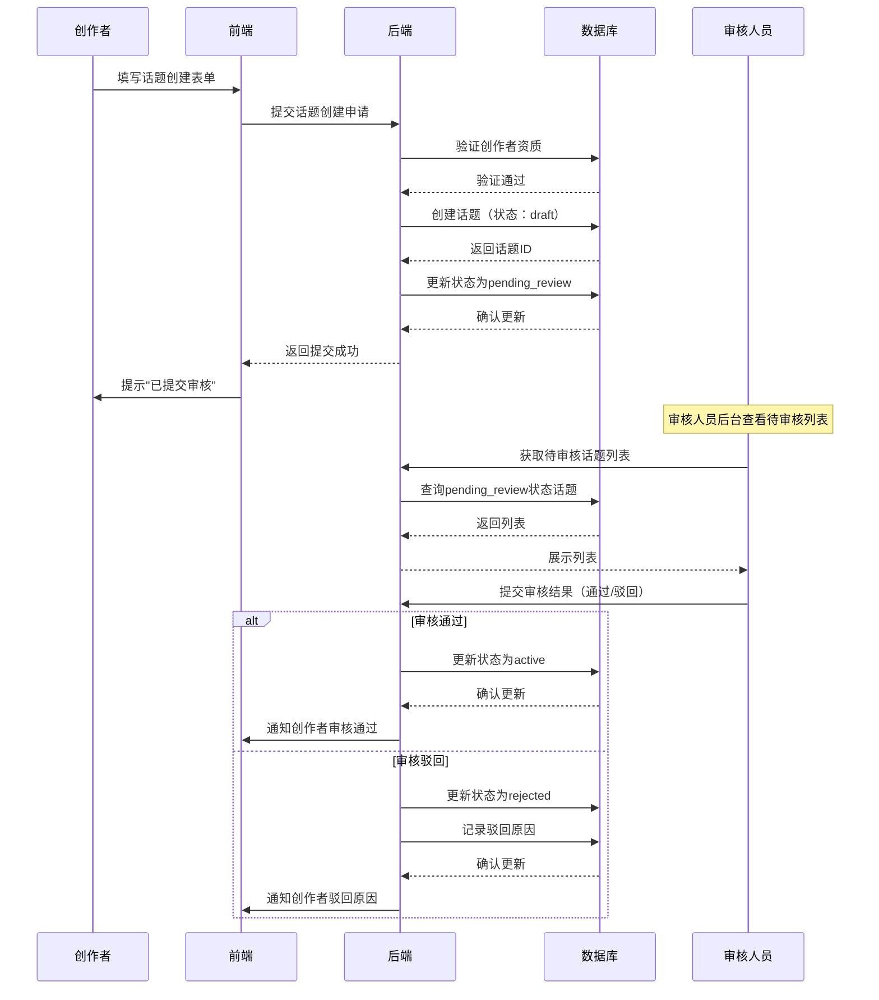
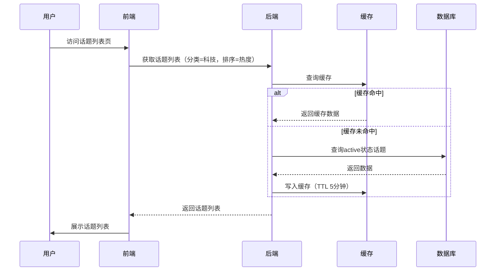

# 话题与市场管理模块 PRD

## 一、模块概述

### 1.1 模块核心定位与业务价值
话题与市场管理模块是平台内容生态的核心，负责知识话题的创建、审核、展示、生命周期管理。该模块直接决定了平台的内容质量和用户体验，是吸引用户参与预测的基础设施。优质的话题内容是平台核心竞争力的体现。

### 1.2 模块所属项目阶段
Phase1 MVP（10-14周，越南首发）

### 1.3 模块与其他系统模块的关联关系
- **上游依赖**：用户与权限体系模块（用户身份、创作者资质）
- **下游依赖**：LMSR交易引擎模块（市场交易）、到期结算核心模块（结果判定）
- **平行依赖**：内容风控基础模块（内容审核）、运营后台核心模块（数据管理）

### 1.4 模块合规红线与技术约束
**合规红线：**
1. 话题内容严格规避体育赛事比分、政治选举、宗教相关高风险方向
2. 核心聚焦科技、商业、文化、学术等知识类赛道
3. 所有话题必须经过审核才能上线，禁止用户直接发布
4. 话题表述必须使用"预测""市场共识概率"等合规词汇，禁止"赌博""押注""赔率"

**技术约束：**
1. 技术栈：Python FastAPI + PostgreSQL 16 + Redis 7
2. 架构原则：单体应用起步，CQRS读写分离
3. 内容审核：人工审核为主，AI辅助初审
4. 搜索能力：PostgreSQL全文搜索，Phase1不引入Elasticsearch

## 二、角色与权限

### 2.1 该模块涉及的用户角色
| 角色 | 权限边界 |
|------|----------|
| 普通用户 | 浏览话题、搜索话题、查看话题详情、参与预测 |
| 认证创作者 | 创建话题、查看自己创建话题的数据、编辑草稿 |
| 审核人员 | 审核话题申请、驳回违规话题、修改话题内容 |
| 管理员 | 查看所有话题数据、强制下架话题、调整话题分类、审核豁免 |
| 运营人员 | 查看话题统计报表、导出话题数据、配置推荐位 |

### 2.2 各角色在该模块的操作权限边界
- **普通用户**：只读权限，无法创建或修改话题
- **认证创作者**：仅能操作自己创建的话题，且需审核通过才能上线
- **审核人员**：只能审核，无法创建或发布话题
- **管理员/运营**：拥有较高权限，但关键操作需二次确认

## 三、功能范围与优先级

### 3.1 核心功能清单（P0必须实现，MVP必做）
1. 话题分类管理（科技/商业/文化/学术）
2. 话题创建功能（认证创作者）
3. 话题审核流程（审核人员）
4. 话题列表展示（分页、排序、筛选）
5. 话题搜索功能（关键词搜索）
6. 话题详情页（信息展示、参与入口）
7. 话题状态管理（草稿/审核中/已上线/已到期/已下架）
8. 话题到期时间设置
9. 话题结果选项设置（2-10个选项）
10. 基础话题数据统计（参与人数、交易量）

### 3.2 次要功能清单（P1迭代实现，MVP不做）
1. 话题推荐算法
2. 话题标签系统
3. 话题收藏功能
4. 话题分享功能
5. 创作者等级体系
6. 话题评论/讨论区

### 3.3 未来扩展功能清单（P2及以后实现）
1. 话题投票（用户投票决定上线）
2. 话题模板库
3. AI辅助话题创建
4. 话题关联推荐
5. 创作者激励体系

### 3.4 明确MVP阶段不做的功能边界
- 不支持普通用户直接创建话题（需认证创作者）
- 不支持话题评论和讨论
- 不支持话题收藏和分享
- 不支持话题推荐算法（仅按时间/热度排序）
- 不支持话题标签系统

## 四、业务流程与逻辑

### 4.1 核心业务主流程

#### 4.1.1 话题创建与审核流程


#### 4.1.2 话题展示与筛选流程


### 4.2 详细业务规则

#### 4.2.1 话题分类规则
- **固定分类**：科技、商业、文化、学术（Phase1不可新增）
- **分类选择**：创建时必须选择一个主分类
- **分类展示**：列表页支持按分类筛选

#### 4.2.2 话题创建规则
- **创作者资质**：必须完成实名认证 + 创作者申请（运营审批）
- **标题要求**：10-50个字符，清晰明确，无歧义
- **描述要求**：50-500个字符，包含背景信息、判定依据
- **结果选项**：2-10个选项，互斥且穷尽
- **到期时间**：最短1天，最长365天

#### 4.2.3 话题审核规则
- **审核时效**：24小时内完成审核
- **审核标准**：
  - 符合合规要求（无体育、政治、宗教内容）
  - 表述清晰，无歧义
  - 结果选项可判定
  - 到期时间合理
- **驳回处理**：创作者可修改后重新提交

#### 4.2.4 话题状态流转规则
```
draft（草稿） → pending_review（待审核） → active（已上线） → expired（已到期） → settled（已结算）
                              ↓
                         rejected（已驳回） → draft（可修改重提）
                         
active（已上线） → suspended（已下架） → （管理员操作）
```

#### 4.2.5 话题排序规则
- **默认排序**：按热度排序（交易量 × 参与人数）
- **可选排序**：最新、最热、即将到期
- **筛选条件**：分类、状态、到期时间范围

### 4.3 异常场景处理方案

#### 4.3.1 内容违规处理
- **上线前发现**：审核驳回，通知创作者修改
- **上线后发现**：管理员强制下架，冻结相关交易
- **批量违规**：暂停创作者资质，全面审查其创建话题

#### 4.3.2 话题争议处理
- **结果判定争议**：运营团队仲裁，必要时延期结算
- **信息错误**：允许修正描述，但不改变结果选项
- **用户投诉**：客服介入，48小时内响应

#### 4.3.3 系统异常处理
- **审核队列积压**：自动通知审核人员，必要时增加人手
- **话题数据异常**：自动告警，人工介入修复
- **缓存失效**：降级为数据库直查

## 五、前端页面与交互要求

### 5.1 页面清单与原型跳转逻辑
1. **话题列表页**：展示所有可参与话题，支持分类筛选和排序
2. **话题详情页**：展示话题完整信息、结果选项、当前概率、参与入口
3. **话题创建页**：创作者填写话题信息表单
4. **话题管理页**：创作者查看自己创建的话题状态和数据
5. **审核后台页**：审核人员查看待审核列表、执行审核操作
6. **话题搜索结果页**：展示搜索匹配的话题列表

### 5.2 核心页面元素与交互规则
- **话题卡片**：标题、分类标签、到期时间、参与人数、当前概率分布
- **筛选器**：分类选择器、排序选择器、到期时间范围选择器
- **创建表单**：标题输入、描述输入、结果选项动态添加、到期时间选择器
- **审核操作区**：话题详情预览、通过/驳回按钮、驳回原因输入框
- **状态标签**：清晰标识话题状态（审核中/进行中/已到期/已结算）

### 5.3 多语言适配要求
- 支持越南语、英语
- 分类名称本地化翻译
- 日期时间格式：DD/MM/YYYY HH:mm
- 字符数限制按当地语言习惯调整

### 5.4 响应式适配要求
- 适配手机竖屏（320px-414px）
- 话题卡片在小屏幕上简化显示
- 创建表单分步展示，避免单页过长
- 筛选器支持抽屉式展开

## 六、数据模型与接口要求

### 6.1 核心数据实体与字段要求

#### 6.1.1 话题表 (topics)
| 字段名 | 类型 | 必填 | 描述 |
|--------|------|------|------|
| id | UUID | 是 | 话题ID |
| title | VARCHAR(100) | 是 | 话题标题 |
| description | TEXT | 是 | 话题描述 |
| category | VARCHAR(50) | 是 | 分类（tech/business/culture/academic） |
| outcome_options | JSONB | 是 | 结果选项列表 |
| creator_id | UUID | 是 | 创作者ID |
| status | VARCHAR(20) | 是 | 状态（draft/pending_review/active/expired/settled/rejected/suspended） |
| expires_at | TIMESTAMP | 是 | 到期时间 |
| settled_at | TIMESTAMP | 否 | 结算时间 |
| settled_outcome | INT | 否 | 结算结果索引 |
| view_count | BIGINT | 是 | 浏览次数 |
| participant_count | BIGINT | 是 | 参与人数 |
| trade_volume | BIGINT | 是 | 交易总量 |
| created_at | TIMESTAMP | 是 | 创建时间 |
| updated_at | TIMESTAMP | 是 | 更新时间 |

#### 6.1.2 话题审核记录表 (topic_reviews)
| 字段名 | 类型 | 必填 | 描述 |
|--------|------|------|------|
| id | UUID | 是 | 审核记录ID |
| topic_id | UUID | 是 | 话题ID |
| auditor_id | UUID | 是 | 审核人员ID |
| action | VARCHAR(20) | 是 | 审核动作（approved/rejected） |
| reason | TEXT | 否 | 驳回原因 |
| created_at | TIMESTAMP | 是 | 审核时间 |

#### 6.1.3 创作者资质表 (creator_profiles)
| 字段名 | 类型 | 必填 | 描述 |
|--------|------|------|------|
| user_id | UUID | 是 | 用户ID |
| status | VARCHAR(20) | 是 | 资质状态（pending/approved/rejected） |
| approved_by | UUID | 否 | 审批人ID |
| approved_at | TIMESTAMP | 否 | 审批通过时间 |
| topic_count | INT | 是 | 已创建话题数 |
| approved_topic_count | INT | 是 | 审核通过话题数 |
| created_at | TIMESTAMP | 是 | 创建时间 |

### 6.2 核心接口清单与入参/出参核心要求

#### 6.2.1 获取话题列表
- **URL**: GET /api/v1/topics
- **入参**: category=tech, sort=hot, page=1, limit=20
- **出参**: 
  ```json
  {
    "topics": [
      {
        "id": "uuid",
        "title": "AI将取代多少工作岗位？",
        "category": "tech",
        "outcome_count": 3,
        "expires_at": "2026-03-26T00:00:00Z",
        "participant_count": 150,
        "trade_volume": 50000,
        "current_prices": [0.25, 0.45, 0.30]
      }
    ],
    "total": 100,
    "page": 1,
    "limit": 20
  }
  ```

#### 6.2.2 获取话题详情
- **URL**: GET /api/v1/topics/{topic_id}
- **入参**: 无
- **出参**: 
  ```json
  {
    "topic": {
      "id": "uuid",
      "title": "AI将取代多少工作岗位？",
      "description": "预测AI技术对就业市场的影响程度...",
      "category": "tech",
      "outcome_options": ["<30%", "30-70%", ">70%"],
      "creator": {"id": "uuid", "name": "匿名用户"},
      "expires_at": "2026-03-26T00:00:00Z",
      "status": "active",
      "participant_count": 150,
      "trade_volume": 50000,
      "current_prices": [0.25, 0.45, 0.30]
    }
  }
  ```

#### 6.2.3 创建话题
- **URL**: POST /api/v1/topics
- **入参**: 
  ```json
  {
    "title": "AI将取代多少工作岗位？",
    "description": "预测AI技术对就业市场的影响程度...",
    "category": "tech",
    "outcome_options": ["<30%", "30-70%", ">70%"],
    "expires_at": "2026-03-26T00:00:00Z"
  }
  ```
- **出参**: 
  ```json
  {
    "topic_id": "uuid",
    "status": "pending_review"
  }
  ```

#### 6.2.4 提交审核
- **URL**: POST /api/v1/topics/{topic_id}/review
- **入参**: 
  ```json
  {
    "action": "approved",
    "reason": ""
  }
  ```
- **出参**: 
  ```json
  {
    "topic_id": "uuid",
    "status": "active"
  }
  ```

#### 6.2.5 搜索话题
- **URL**: GET /api/v1/topics/search
- **入参**: q=AI, page=1, limit=20
- **出参**: 同话题列表格式

#### 6.2.6 获取创作者资质状态
- **URL**: GET /api/v1/creator/profile
- **入参**: 无
- **出参**: 
  ```json
  {
    "status": "approved",
    "topic_count": 5,
    "approved_topic_count": 4
  }
  ```

### 6.3 数据读写性能要求
- 话题列表查询：< 200ms (P95，20条记录）
- 话题详情查询：< 150ms (P95)
- 话题搜索：< 300ms (P95)
- 话题创建：< 300ms (P95)
- 并发支持：100 TPS

### 6.4 数据存储与归档要求
- 话题数据：永久存储
- 审核记录：永久存储
- 操作日志：保留180天
- 敏感数据：无需特殊加密

## 七、非功能需求

### 7.1 性能指标
- 接口响应时间：< 300ms (P95)
- 并发量支持：100+ TPS
- 页面加载时长：首屏 < 2s

### 7.2 可用性要求
- 服务可用性SLA：99.9%
- 故障降级策略：
  - 数据库只读：允许查询，禁止创建/审核
  - Redis不可用：降级为数据库直查
  - 审核系统不可用：允许查询，审核流程延迟

### 7.3 可扩展性要求
- 分类配置化，便于后续扩展
- 审核流程可配置（单级/多级审核）
- 搜索能力预留Elasticsearch接入接口

### 7.4 兼容性要求
- 浏览器：Chrome、Safari、Firefox最新2个版本
- 设备：iOS 12+、Android 8+
- 语言：越南语、英语

### 7.5 监控告警指标
- **核心业务指标**：
  - 话题创建成功率：阈值 > 95%，低于阈值触发告警
  - 话题审核及时率：阈值 > 90%，低于阈值触发告警  
  - 话题列表查询响应时间：阈值 < 300ms (P95)，超过阈值触发告警
  - 搜索响应时间：阈值 < 300ms (P95)，超过阈值触发告警
  
- **系统健康指标**：
  - 审核队列积压：待审核话题数 > 50，触发告警
  - 数据库连接池使用率：阈值 > 80%，超过阈值触发告警
  - Redis缓存命中率：阈值 < 80%，低于阈值触发告警
  - API错误率：阈值 > 1%，超过阈值触发告警
  
- **安全合规指标**：
  - 敏感内容漏检率：阈值 > 0.1%，超过阈值触发告警
  - 创作者资质验证失败率：阈值 > 5%，超过阈值触发告警

## 八、安全与合规要求

### 8.1 接口权限控制要求
- 所有写操作接口需要JWT Token认证
- 创作者只能操作自己创建的话题
- 审核和管理接口需要额外角色权限

### 8.2 数据加密与脱敏要求
- 创作者身份在公开场合匿名显示
- 审核记录仅内部可见
- API响应中的敏感信息：部分脱敏

### 8.3 操作审计日志要求
- 记录所有话题创建、审核、修改操作
- 包含操作人、操作时间、操作类型、操作详情
- 日志保留180天，支持按话题ID、用户ID、时间范围查询

### 8.4 合规校验规则与拦截逻辑
- 话题内容关键词过滤（体育、政治、宗教相关）
- 创作者资质前置校验
- 话题到期时间范围校验
- 敏感话题人工复审

### 8.5 防刷、防并发、防篡改要求
- 防重复提交：前端按钮防重 + 后端幂等性校验
- 防并发冲突：数据库行级锁
- 防篡改：HTTPS传输 + 请求签名验证
- 防刷：IP限流（10次/分钟）、行为分析

## 九、埋点与数据分析要求

### 9.1 核心埋点事件清单
- topic_list_view: 话题列表页访问
- topic_detail_view: 话题详情页访问
- topic_search: 话题搜索
- topic_create_submit: 话题创建提交
- topic_review_action: 话题审核操作
- topic_filter: 话题筛选操作

### 9.2 核心数据指标定义
- 话题创建成功率 = 审核通过数 / 提交审核数
- 话题平均审核时长 = 总审核时长 / 审核完成数
- 话题参与率 = 参与人数 / 浏览次数
- 热门话题TOP10 = 按交易量排序

### 9.3 数据统计与看板要求
- 话题创建趋势看板
- 审核效率监控看板
- 话题分类分布统计
- 创作者贡献排行榜

## 十、验收标准

### 10.1 功能验收标准
- [ ] 认证创作者可正常创建话题
- [ ] 话题审核流程完整（提交-审核-通过/驳回）
- [ ] 话题列表正确展示和筛选
- [ ] 话题搜索功能正常
- [ ] 话题详情页信息完整准确
- [ ] 话题状态流转正确
- [ ] 创作者资质管理正常
- [ ] 审核后台功能完整

### 10.2 性能验收标准
- [ ] 话题列表查询响应时间 < 200ms (P95)
- [ ] 话题详情查询响应时间 < 150ms (P95)
- [ ] 话题搜索响应时间 < 300ms (P95)
- [ ] 系统支持100 TPS并发查询

### 10.3 安全合规验收标准
- [ ] 通过第三方安全扫描（无高危漏洞）
- [ ] 话题内容合规检查100%覆盖
- [ ] 创作者资质校验100%准确
- [ ] 所有操作都有完整审计日志
- [ ] 敏感内容关键词过滤有效

### 10.4 兼容性验收标准
- [ ] 在iOS和Android主流机型上正常运行
- [ ] 越南语和英语界面显示正确
- [ ] 在Chrome、Safari、Firefox浏览器上功能正常

## 十一、附件

### 11.1 产品原型图
- 话题列表页原型
- 话题详情页原型
- 话题创建页原型
- 审核后台页原型

### 11.2 流程图/时序图
- 话题创建与审核流程时序图（见4.1.1）
- 话题展示与筛选流程时序图（见4.1.2）
- 话题状态流转图

### 11.3 相关合规文件/参考资料
- 越南Decree 06/2017/ND-CP博彩管制条例摘要
- 内容审核最佳实践指南
- 话题分类标准定义

### 11.4 版本变更记录
| 版本 | 日期 | 修改内容 | 修改人 |
|------|------|----------|--------|
| v1.0 | 2026-02-26 | 初稿 | 产品经理 |