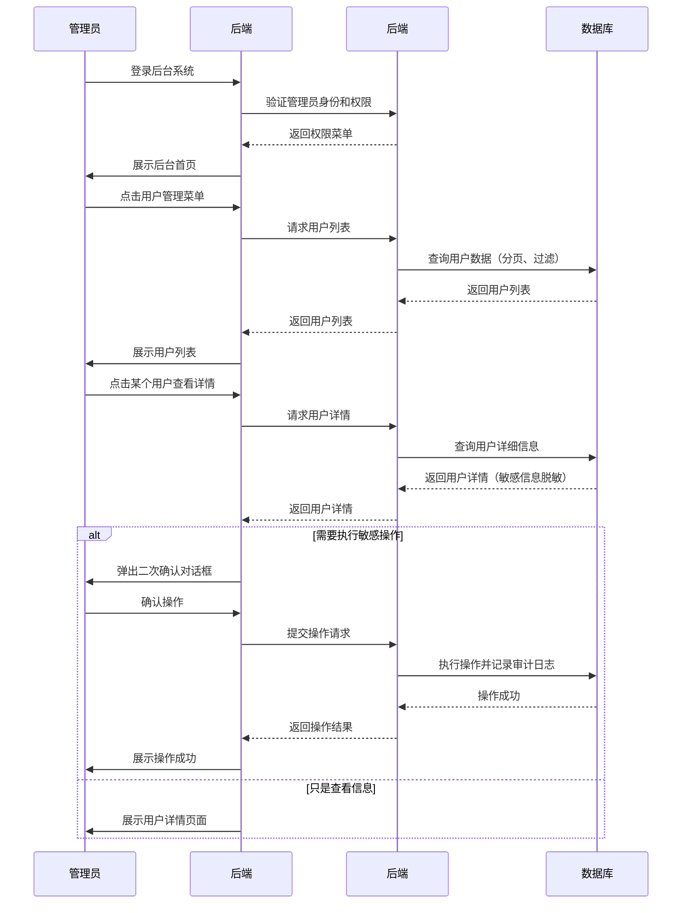
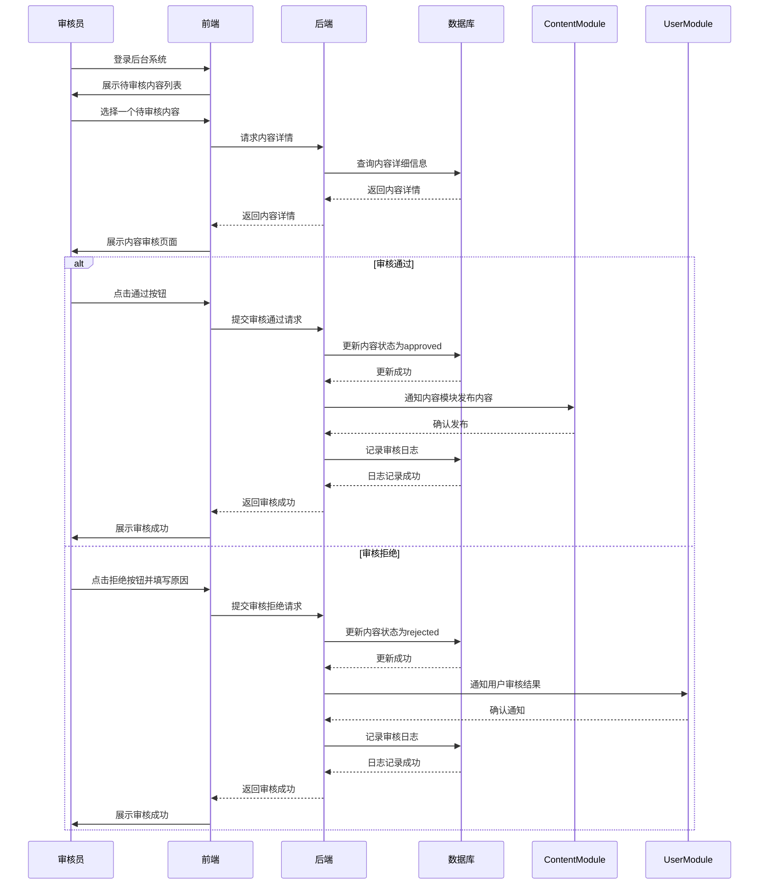

# 运营后台核心模块 PRD

## 一、模块概述

### 1.1 模块核心定位与业务价值
运营后台核心模块是平台的管理控制中心，为管理员、运营人员、审核人员提供用户管理、内容管理、数据监控、系统配置等核心功能。该模块直接关系到平台的运营效率和合规性，是MVP阶段必须实现的管理模块。

### 1.2 模块所属项目阶段
Phase1 MVP（10-14周，越南首发）

### 1.3 模块与其他系统模块的关联关系
- **上游依赖**：所有前端业务模块（钱包、交易、商城、用户等）
- **下游依赖**：无（管理模块）
- **平行依赖**：内容风控基础模块（风控数据展示）

### 1.4 模块合规红线与技术约束
**合规红线：**
1. 后台操作必须保留完整审计日志，满足当地监管要求
2. 敏感操作（资金调整、账户冻结）必须有二次确认和审批流程
3. 用户隐私数据在后台展示时必须脱敏处理
4. 所有操作必须基于明确的角色权限控制

**技术约束：**
1. 技术栈：Python FastAPI + PostgreSQL 16 + Redis 7
2. 前端框架：Vue3 + Element Plus（管理后台组件库）
3. 架构原则：单体应用起步，CQRS读写分离
4. 数据安全：敏感数据加密存储，操作日志完整记录

## 二、角色与权限

### 2.1 该模块涉及的用户角色
| 角色 | 权限边界 |
|------|----------|
| 超级管理员 | 全系统管理权限，包括用户管理、内容管理、系统配置、权限分配 |
| 管理员 | 用户管理、内容管理、基础系统配置，无权限分配权限 |
| 运营人员 | 数据报表查看、用户行为分析、商品管理、活动配置 |
| 审核人员 | 内容审核、用户申诉处理、违规处理 |
| 财务人员 | 资金流水查询、对账报表、财务数据导出 |

### 2.2 各角色在该模块的操作权限边界
- **超级管理员**：拥有全部权限，可分配其他角色权限
- **管理员**：可执行日常管理操作，但无法修改系统核心配置
- **运营人员**：主要数据查询和分析权限，有限的内容管理权限
- **审核人员**：专注于内容和用户审核，无系统配置权限
- **财务人员**：仅限财务相关数据查询，无其他操作权限

## 三、功能范围与优先级

### 3.1 核心功能清单（P0必须实现，MVP必做）
1. 仪表盘（关键指标概览）
2. 用户管理（查询、详情、状态管理）
3. 内容管理（话题审核、商品审核）
4. 交易监控（实时交易数据）
5. 资金流水查询
6. 系统配置（基础参数设置）
7. 操作审计日志
8. 数据报表（基础统计）
9. 角色权限管理
10. 通知公告管理

### 3.2 次要功能清单（P1迭代实现，MVP不做）
1. 高级数据分析（用户画像、行为分析）
2. 自动化运营工具（批量操作、定时任务）
3. A/B测试管理
4. 客服工单系统
5. 第三方集成管理

### 3.3 未来扩展功能清单（P2及以后实现）
1. 多租户管理（企业版）
2. API管理门户
3. 智能运营建议
4. 风控规则引擎
5. 国际化多语言后台

### 3.4 明确MVP阶段不做的功能边界
- 不支持高级数据分析和用户画像
- 不支持自动化运营工具和批量操作
- 不支持A/B测试管理
- 不支持客服工单系统
- 不支持第三方集成管理

## 四、业务流程与逻辑

### 4.1 核心业务主流程

#### 4.1.1 用户管理主流程


#### 4.1.2 内容审核主流程


### 4.2 详细业务规则

#### 4.2.1 用户管理规则
- 用户列表支持多维度筛选（注册时间、状态、角色、地域等）
- 用户详情展示脱敏信息（手机号、身份证号部分隐藏）
- 敏感操作（冻结账户、调整余额）需要二次确认
- 所有用户操作都记录完整的审计日志

#### 4.2.2 内容管理规则
- 待审核内容按优先级排序（紧急内容置顶）
- 审核操作必须填写审核意见（通过可选，拒绝必填）
- 审核超时自动提醒（24小时未处理）
- 审核历史完整记录，支持追溯

#### 4.2.3 数据报表规则
- 关键指标实时更新（用户数、交易额、活跃度等）
- 报表支持自定义时间范围（今日、本周、本月、自定义）
- 数据导出支持CSV格式，单次最多导出10万条
- 敏感数据在报表中脱敏处理

#### 4.2.4 系统配置规则
- 基础配置项支持动态修改（无需重启服务）
- 配置修改需要权限验证和操作日志记录
- 关键配置修改需要二次确认
- 配置历史版本保留，支持回滚

### 4.2.5 跨模块数据一致性规则
- **Saga模式实现**：跨模块操作采用Saga分布式事务模式，每个步骤都有对应的补偿事务
- **补偿事务机制**：
  - 用户资金调整失败 → 自动回滚用户状态变更
  - 内容审核通过但发布失败 → 自动回滚审核状态
  - 批量操作部分失败 → 提供手动重试和补偿入口
- **定时对账任务**：
  - 每小时执行一次跨模块数据一致性检查
  - 每日02:00执行全量数据对账
  - 发现不一致数据自动告警并生成修复任务

### 4.3 异常场景处理方案

#### 4.3.1 网络异常
- **数据加载超时**：显示加载失败提示，提供重试按钮
- **操作提交超时**：显示操作中状态，提供操作状态查询
- **服务不可用**：降级为只读模式，禁止所有写操作

#### 4.3.2 并发冲突
- 使用乐观锁防止同一记录并发修改
- 敏感操作使用分布式锁防止重复执行
- 数据导出使用队列处理，避免资源耗尽

#### 4.3.3 数据异常
- 大数据量查询自动分页，防止内存溢出
- 敏感操作前进行数据校验，防止无效操作
- 操作失败提供详细错误信息和解决方案

#### 4.3.4 权限异常
- 无权限操作自动拦截，返回403错误
- 权限变更实时生效，无需重新登录
- 越权操作记录安全日志，触发告警

## 五、前端页面与交互要求

### 5.1 页面清单与原型跳转逻辑
1. **仪表盘**：关键指标卡片、趋势图表、快捷操作入口
2. **用户管理**：用户列表、用户详情、批量操作
3. **内容管理**：待审核列表、已审核列表、内容详情
4. **交易监控**：实时交易流、交易统计、异常交易标记
5. **资金管理**：资金流水、对账报表、财务统计
6. **系统配置**：基础配置、角色权限、通知设置
7. **数据报表**：用户报表、交易报表、商品报表
8. **操作日志**：操作记录查询、安全日志、审计追踪

### 5.2 核心页面元素与交互规则
- **数据表格**：支持排序、筛选、分页、导出
- **操作按钮**：根据用户权限动态显示，敏感操作高亮提示
- **表单验证**：实时验证，错误提示清晰
- **批量操作**：支持勾选多项，操作前确认数量
- **数据可视化**：图表支持交互（hover显示详情、点击钻取）

### 5.3 多语言适配要求
- 支持越南语、英语
- 数字格式按当地习惯（越南：1.000.000）
- 日期时间格式：DD/MM/YYYY HH:mm
- 货币格式：VND（越南盾）

### 5.4 响应式适配要求
- 主要适配桌面端（1280px+）
- 表格在小屏幕上支持横向滚动
- 关键操作按钮在移动端保持可点击
- 图表在不同屏幕尺寸下自适应

## 六、数据模型与接口要求

### 6.1 核心数据实体与字段要求

#### 6.1.1 管理员表 (admins)
| 字段名 | 类型 | 必填 | 描述 |
|--------|------|------|------|
| id | UUID | 是 | 管理员ID |
| username | VARCHAR(50) | 是 | 用户名 |
| password_hash | VARCHAR(255) | 是 | 密码哈希 |
| full_name | VARCHAR(100) | 是 | 真实姓名 |
| email | VARCHAR(255) | 是 | 邮箱 |
| role | VARCHAR(50) | 是 | 角色（super_admin/admin/operation/auditor/finance） |
| permissions | JSONB | 是 | 权限列表 |
| status | VARCHAR(20) | 是 | 状态（active/inactive） |
| last_login_at | TIMESTAMP | 否 | 最后登录时间 |
| created_at | TIMESTAMP | 是 | 创建时间 |
| updated_at | TIMESTAMP | 是 | 更新时间 |

#### 6.1.2 操作日志表 (admin_audit_logs)
| 字段名 | 类型 | 必填 | 描述 |
|--------|------|------|------|
| id | UUID | 是 | 日志ID |
| admin_id | UUID | 是 | 管理员ID |
| action | VARCHAR(100) | 是 | 操作类型 |
| target_type | VARCHAR(50) | 是 | 目标类型（user/content/transaction等） |
| target_id | UUID | 否 | 目标ID |
| details | JSONB | 是 | 操作详情 |
| ip_address | VARCHAR(45) | 是 | IP地址 |
| user_agent | TEXT | 是 | 用户代理 |
| created_at | TIMESTAMP | 是 | 创建时间 |

#### 6.1.3 系统配置表 (system_configs)
| 字段名 | 类型 | 必填 | 描述 |
|--------|------|------|------|
| key | VARCHAR(100) | 是 | 配置键 |
| value | TEXT | 是 | 配置值 |
| category | VARCHAR(50) | 是 | 配置分类 |
| description | TEXT | 是 | 配置描述 |
| data_type | VARCHAR(20) | 是 | 数据类型（string/number/boolean/json） |
| is_sensitive | BOOLEAN | 是 | 是否敏感配置 |
| updated_by | UUID | 是 | 更新人ID |
| updated_at | TIMESTAMP | 是 | 更新时间 |

#### 6.1.4 审核任务表 (review_tasks)
| 字段名 | 类型 | 必填 | 描述 |
|--------|------|------|------|
| id | UUID | 是 | 任务ID |
| content_type | VARCHAR(50) | 是 | 内容类型（topic/product） |
| content_id | UUID | 是 | 内容ID |
| status | VARCHAR(20) | 是 | 状态（pending/approved/rejected） |
| assigned_to | UUID | 否 | 分配给的审核员ID |
| reviewed_by | UUID | 否 | 审核人ID |
| review_notes | TEXT | 否 | 审核备注 |
| deadline_at | TIMESTAMP | 是 | 截止时间 |
| created_at | TIMESTAMP | 是 | 创建时间 |
| updated_at | TIMESTAMP | 是 | 更新时间 |

### 6.2 核心接口清单与入参/出参核心要求

#### 6.2.1 获取仪表盘数据
- **URL**: GET /api/v1/admin/dashboard
- **入参**: 无
- **出参**: 
  ```json
  {
    "metrics": {
      "total_users": 10000,
      "active_users_24h": 2000,
      "total_transactions": 5000,
      "pending_reviews": 25,
      "system_status": "healthy"
    },
    "charts": {
      "user_growth": [...],
      "transaction_volume": [...]
    }
  }
  ```

#### 6.2.2 用户列表查询
- **URL**: GET /api/v1/admin/users
- **入参**: page=1, limit=20, status=verified_18plus, start_date=2026-02-01
- **出参**: 
  ```json
  {
    "users": [
      {
        "id": "uuid",
        "phone": "138****1234",
        "email": "user@example.com",
        "status": "verified_18plus",
        "created_at": "2026-02-26T00:00:00Z",
        "last_login_at": "2026-02-26T10:00:00Z"
      }
    ],
    "total": 10000,
    "page": 1,
    "limit": 20
  }
  ```

#### 6.2.3 用户详情查询
- **URL**: GET /api/v1/admin/users/{user_id}
- **入参**: 无
- **出参**: 
  ```json
  {
    "user": {
      "id": "uuid",
      "phone": "138****1234",
      "email": "user@example.com",
      "full_name": "Nguyen Van A",
      "id_number": "123***7890",
      "birth_date": "2000-01-01",
      "age": 26,
      "status": "verified_18plus",
      "role": "user",
      "wallet_balance": 10000,
      "total_transactions": 25,
      "created_at": "2026-02-26T00:00:00Z",
      "last_login_at": "2026-02-26T10:00:00Z"
    }
  }
  ```

#### 6.2.4 执行用户操作
- **URL**: POST /api/v1/admin/users/{user_id}/actions
- **入参**: 
  ```json
  {
    "action": "freeze_account",
    "reason": "Suspicious activity"
  }
  ```
- **出参**: 
  ```json
  {
    "message": "操作成功",
    "new_status": "frozen"
  }
  ```

#### 6.2.5 待审核内容列表
- **URL**: GET /api/v1/admin/reviews/pending
- **入参**: content_type=topic, page=1, limit=20
- **出参**: 
  ```json
  {
    "tasks": [...],
    "total": 25,
    "page": 1,
    "limit": 20
  }
  ```

#### 6.2.6 提交审核结果
- **URL**: POST /api/v1/admin/reviews/{task_id}/submit
- **入参**: 
  ```json
  {
    "result": "approved",
    "notes": "Content meets guidelines"
  }
  ```
- **出参**: 
  ```json
  {
    "message": "审核成功",
    "new_status": "approved"
  }
  ```

### 6.3 数据读写性能要求
- 仪表盘数据加载：< 500ms (P95)
- 用户列表查询：< 300ms (P95，20条记录）
- 用户详情查询：< 200ms (P95)
- 审核操作提交：< 300ms (P95)
- 并发支持：50 TPS（管理操作）

### 6.4 数据存储与归档要求
- 管理员数据：永久存储
- 操作日志：保留180天
- 系统配置：永久存储，保留历史版本
- 敏感数据：加密存储（AES-256）

## 七、非功能需求

### 7.1 性能指标
- 接口响应时间：< 500ms (P95)
- 并发量支持：50 TPS（管理操作）
- 页面加载时长：首屏 < 2s，复杂报表 < 3s

### 7.2 可用性要求
- 服务可用性SLA：99.9%
- 故障降级策略：
  - 数据库只读：允许查询，禁止写操作
  - Redis不可用：降级为数据库直查
  - 第三方服务不可用：显示维护提示

### 7.3 可扩展性要求
- 权限体系RBAC设计，支持细粒度权限控制
- 配置管理支持动态扩展
- 报表系统插件化设计，便于后续扩展

### 7.4 兼容性要求
- 浏览器：Chrome、Safari、Firefox最新2个版本
- 设备：桌面端（1280px+），基本适配平板
- 语言：越南语、英语

### 7.5 监控告警指标
**核心业务指标监控：**
- **用户管理监控**：
  - 管理员登录失败率 > 5%（5分钟内）→ 告警
  - 敏感操作执行频率 > 10次/小时 → 告警
  - 用户状态批量变更 > 100个/次 → 告警

- **内容审核监控**：
  - 审核队列积压 > 50个待处理 → 告警
  - 审核超时率 > 10%（24小时内未处理）→ 告警
  - 审核通过率异常波动（±20%）→ 告警

- **系统性能监控**：
  - 后台接口响应时间 > 1000ms（P95）→ 告警
  - 数据库查询慢查询 > 500ms → 告警
  - 内存使用率 > 80% → 告警

- **安全监控**：
  - 越权访问尝试 > 3次/小时 → 告警
  - 敏感数据导出 > 1000条/次 → 告警
  - 异常IP登录 > 5次/天 → 告警

**告警分级：**
- **P0（紧急）**：立即通知，需30分钟内响应（如安全事件、数据一致性问题）
- **P1（高）**：1小时内响应（如性能严重下降、关键功能不可用）
- **P2（中）**：4小时内响应（如一般性能问题、非关键功能异常）
- **P3（低）**：24小时内响应（如轻微性能问题、用户体验优化）

**监控覆盖：**
- 所有核心业务流程100%覆盖
- 所有跨模块数据一致性检查
- 所有安全敏感操作审计
- 所有性能关键路径监控

## 八、安全与合规要求

### 8.1 接口权限控制要求
- 所有后台接口需要管理员JWT Token认证
- 操作权限基于角色和具体权限点控制
- 敏感操作需要二次确认和操作日志记录

### 8.2 数据加密与脱敏要求
- 管理员密码：bcrypt哈希存储
- 用户敏感信息：AES-256加密存储，后台展示脱敏
- 操作日志：完整记录，包含IP地址和设备信息

### 8.3 操作审计日志要求
- 记录所有管理员操作
- 包含操作人、操作时间、操作类型、操作详情、IP地址
- 日志保留180天，支持按操作类型、时间范围查询
- 敏感操作触发实时告警

### 8.4 合规校验规则与拦截逻辑
- 用户隐私数据脱敏展示
- 敏感操作二次确认
- 权限最小化原则
- 操作日志满足监管要求

### 8.5 防刷、防并发、防篡改要求
- 防暴力破解：登录失败锁定机制
- 防越权访问：严格的权限验证
- 防数据篡改：操作日志 + 数据校验
- 防异常操作：行为分析 + 实时告警

## 九、埋点与数据分析要求

### 9.1 核心埋点事件清单
- admin_login: 管理员登录
- admin_dashboard_view: 仪表盘访问
- user_list_view: 用户列表访问
- user_detail_view: 用户详情访问
- user_action_execute: 用户操作执行
- content_review_start: 内容审核开始
- content_review_submit: 内容审核提交
- report_export: 报表导出

### 9.2 核心数据指标定义
- 管理员活跃度 = 日活跃管理员数 / 总管理员数
- 审核效率 = 平均审核时长 / 审核任务数
- 操作成功率 = 成功操作次数 / 总操作次数
- 系统响应时间 = P95接口响应时间

### 9.3 数据统计与看板要求
- 管理员操作监控看板
- 审核任务处理效率分析
- 系统性能监控
- 安全操作告警

## 十、验收标准

### 10.1 功能验收标准
- [ ] 管理员可正常登录和使用后台系统
- [ ] 用户管理功能完整，支持查询、详情、状态管理
- [ ] 内容审核流程完整，支持通过/拒绝操作
- [ ] 仪表盘数据准确，关键指标实时更新
- [ ] 操作审计日志完整记录所有管理员操作
- [ ] 角色权限控制准确，无越权访问
- [ ] 敏感数据在后台展示时正确脱敏
- [ ] 系统配置支持动态修改

### 10.2 性能验收标准
- [ ] 仪表盘数据加载时间 < 500ms (P95)
- [ ] 用户列表查询时间 < 300ms (P95)
- [ ] 系统支持50 TPS并发管理操作
- [ ] 复杂报表加载时间 < 3s

### 10.3 安全合规验收标准
- [ ] 通过第三方安全扫描（无高危漏洞）
- [ ] 敏感操作都有二次确认和完整审计日志
- [ ] 用户隐私数据正确脱敏展示
- [ ] 权限控制100%准确，无越权访问
- [ ] 操作日志满足当地监管要求

### 10.4 兼容性验收标准
- [ ] 在Chrome、Safari、Firefox浏览器上功能正常
- [ ] 越南语和英语界面显示正确
- [ ] 在1280px+屏幕尺寸上布局正常

## 十一、附件

### 11.1 产品原型图
- 仪表盘原型
- 用户管理页面原型
- 内容审核页面原型
- 数据报表页面原型

### 11.2 流程图/时序图
- 用户管理主流程时序图（见4.1.1）
- 内容审核主流程时序图（见4.1.2）
- 权限控制流程图

### 11.3 相关合规文件/参考资料
- 越南Decree 06/2017/ND-CP博彩管制条例摘要
- 越南个人信息保护相关法规
- GDPR/CCPA合规指南（国际化参考）
- 管理后台安全最佳实践

### 11.4 版本变更记录
| 版本 | 日期 | 修改内容 | 修改人 |
|------|------|----------|--------|
| v1.0 | 2026-02-26 | 初稿 | 产品经理 |