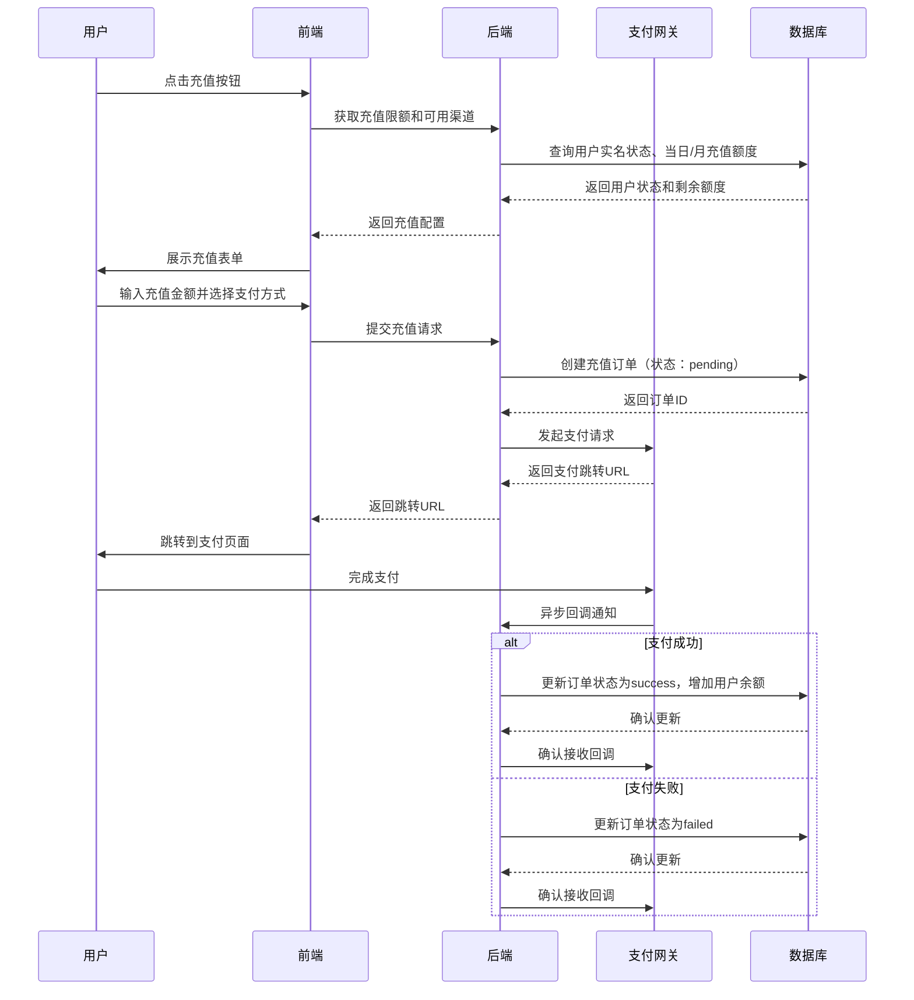

# 钱包与充值支付模块 PRD

## 一、模块概述

### 1.1 模块核心定位与业务价值
钱包与充值支付模块是平台的用户资金入口，负责处理用户法币充值、知识币管理、交易资金结算等核心金融功能。该模块直接关系到平台的合规性和用户体验，是MVP阶段必须优先实现的核心模块。

### 1.2 模块所属项目阶段
Phase1 MVP（10-14周，越南首发）

### 1.3 模块与其他系统模块的关联关系
- **上游依赖**：用户与权限体系模块（用户身份验证）
- **下游依赖**：LMSR交易引擎模块（资金划转）、纯知识币商城模块（消费支出）
- **平行依赖**：运营后台核心模块（资金流水查询）、内容风控基础模块（异常交易监控）

### 1.4 模块合规红线与技术约束
**合规红线：**
1. 平台币（知识币）仅支持法币单向充值，永久不设计提现、用户间转账/赠送功能
2. 严格执行越南市场日限50万VND、月限500万VND充值限额，其他东南亚市场按当地合规要求同步设置
3. 必须落地18+实名注册验证，未完成实名认证用户无法进行充值操作
4. 所有充值流水必须保留完整审计日志，满足当地金融监管要求

**技术约束：**
1. 技术栈：Python FastAPI + PostgreSQL 16 + Redis 7
2. 架构原则：单体应用起步，CQRS读写分离
3. 支付对接：集成当地主流支付网关（越南：MoMo、ZaloPay；泰国：PromptPay等）
4. 数据一致性：关键资金操作必须保证强一致性，使用数据库事务

## 二、角色与权限

### 2.1 该模块涉及的用户角色
| 角色 | 权限边界 |
|------|----------|
| 普通用户 | 查看余额、充值、查看充值记录、查看交易流水 |
| 管理员 | 查看所有用户余额、查看所有充值记录、手动调整余额（仅限客服场景）、冻结账户 |
| 运营人员 | 查看充值统计报表、导出充值数据 |
| 审核人员 | 审核异常充值申请、处理充值争议 |
| 财务人员 | 查看资金对账报表、生成财务结算文件 |

### 2.2 各角色在该模块的操作权限边界
- **普通用户**：仅能操作自己的钱包，无法查看他人信息
- **管理员**：拥有最高权限，可执行所有操作，但敏感操作需二次确认
- **运营/审核/财务**：只读权限为主，无资金操作权限

## 三、功能范围与优先级

### 3.1 核心功能清单（P0必须实现，MVP必做）
1. 用户钱包创建与初始化
2. 法币充值功能（支持越南VND）
3. 充值限额控制（日限50万VND、月限500万VND）
4. 实名认证前置校验
5. 充值记录查询（最近30天）
6. 余额实时查询
7. 交易流水查询（最近30天）
8. 支付网关集成（MoMo、ZaloPay）
9. 充值失败自动退款处理
10. 基础资金安全防护（防重复提交、防并发冲突）

### 3.2 次要功能清单（P1迭代实现，MVP不做）
1. 多币种支持（泰铢、印尼盾、菲律宾比索）
2. 充值优惠活动
3. 充值记录导出
4. 余额变动推送通知
5. 充值渠道扩展（银行卡、信用卡）

### 3.3 未来扩展功能清单（P2及以后实现）
1. 企业账户充值
2. 批量充值API
3. 充值数据分析看板
4. 智能风控拦截

### 3.4 明确MVP阶段不做的功能边界
- 不支持任何形式的提现功能
- 不支持用户间转账/赠送
- 不支持充值记录超过30天的历史查询
- 不支持多币种（仅越南VND）
- 不支持充值优惠活动

## 四、业务流程与逻辑

### 4.1 核心业务主流程

#### 4.1.1 充值主流程


#### 4.1.2 异常分支处理
- **网络超时**：前端显示"处理中"，用户可查询订单状态
- **支付网关不可用**：返回友好错误提示，建议稍后重试
- **并发充值**：使用分布式锁防止超额充值
- **回调重复**：幂等性处理，避免重复入账

### 4.2 详细业务规则

#### 4.2.1 充值限额规则
- 日限额：500,000 VND（自然日00:00-23:59:59）
- 月限额：5,000,000 VND（自然月1日-月末最后一天）
- 限额计算包含所有成功充值订单，失败订单不计入
- 限额重置时间：每日00:00:00，每月1日00:00:00

#### 4.2.2 实名认证规则
- 用户必须完成18+实名认证才能充值
- 实名信息包括：姓名、身份证号、出生日期
- 身份证号需通过当地官方验证接口
- 未满18岁用户禁止充值

#### 4.2.3 充值金额规则
- 最小充值金额：10,000 VND
- 最大单笔充值：500,000 VND（受日限额限制）
- 充值金额必须为1,000 VND的整数倍

#### 4.2.4 知识币兑换规则
- 1 VND = 1 知识币（1:1兑换）
- 兑换比例固定，不随市场波动
- 充值成功后立即到账，无需等待

### 4.3 异常场景处理方案

#### 4.3.1 网络异常
- **前端超时**：显示"处理中"状态，提供订单查询入口
- **后端超时**：记录日志，定时任务补偿处理
- **支付网关超时**：标记订单为"处理中"，异步轮询状态

#### 4.3.2 并发冲突
- 使用Redis分布式锁防止同一用户并发充值
- 数据库层面使用乐观锁（version字段）防止余额更新冲突
- 关键操作添加数据库行级锁

#### 4.3.3 数据异常
- 余额负数：系统自动告警，人工介入处理
- 充值订单状态不一致：定时对账任务修复
- 用户信息缺失：阻断充值流程，引导完善信息

### 4.3.5 跨模块数据一致性保障（新增）
- **Saga模式实现**：跨模块资金操作采用Saga分布式事务模式
  - 充值成功 → 触发钱包余额增加事件 → LMSR交易引擎监听事件
  - 每个步骤都有对应的补偿事务（如充值失败则回滚余额）
- **Saga状态管理**：Saga事务状态需持久化存储，支持断点恢复和超时处理
- **补偿事务机制**：
  - 正向操作：`recharge_success` → `wallet_balance_increase`
  - 补偿操作：`recharge_failed` → `wallet_balance_decrease`（如果已增加）
- **定时对账任务**：
  - 每小时执行一次资金对账
  - 对比钱包余额、充值订单、交易记录的一致性
  - 发现不一致时自动触发补偿事务并告警

#### 4.3.4 第三方服务失败
- 支付网关不可用：降级为维护状态，提示用户稍后重试
- 实名认证服务不可用：缓存最近认证结果，允许已认证用户继续操作
- 数据库连接失败：熔断机制，返回友好错误页面

## 五、前端页面与交互要求

### 5.1 页面清单与原型跳转逻辑
1. **钱包首页**：余额展示、快速充值入口、流水概览
2. **充值页面**：充值金额输入、支付方式选择、限额提示
3. **支付跳转页**：加载中状态、取消返回入口
4. **充值结果页**：成功/失败结果展示、返回钱包首页
5. **充值记录页**：列表展示最近30天充值记录
6. **交易流水页**：列表展示最近30天所有资金变动

### 5.2 核心页面元素与交互规则

#### 5.2.1 钱包首页设计
- **余额展示组件**：
  - 主要信息：大字体显示当前余额（如：100,000 知识币）
  - 隐私保护：默认显示为 ****，点击眼睛图标切换明文/密文
  - 实时更新：WebSocket推送余额变更，避免手动刷新
  - 状态指示：绿色表示正常，红色表示异常（如冻结状态）

- **快速操作区**：
  - 充值按钮：主按钮，固定在底部，高对比度颜色
  - 流水入口：次级按钮，查看最近5笔交易记录
  - 限额进度条：可视化展示日/月充值使用情况
    - 日限额：500,000 VND，已使用 100,000 VND (20%)
    - 月限额：5,000,000 VND，已使用 800,000 VND (16%)

#### 5.2.2 充值页面设计
- **金额输入组件**：
  - 数字键盘：专为移动端优化的数字输入键盘
  - 自动格式化：输入时自动添加千分位分隔符（100000 → 100,000）
  - 实时验证：输入时实时校验是否在限额范围内
  - 快捷金额：预设常用金额按钮（10,000 / 50,000 / 100,000 VND）

- **支付方式选择**：
  - 卡片式布局：每个支付方式以卡片形式展示
  - 图标+文字：MoMo、ZaloPay等支付方式的官方图标
  - 横向滑动：支持水平滚动查看更多支付方式
  - 默认选中：根据用户历史选择智能推荐

- **确认与提交**：
  - 双重确认：大额充值（>100,000 VND）需要二次确认
  - 加载状态：提交后显示加载动画，防止重复提交
  - 错误处理：表单验证错误实时显示在对应字段下方

#### 5.2.3 交互反馈设计
- **成功反馈**：
  - Toast通知：绿色背景，显示"充值成功！100,000 知识币已到账"
  - 动画效果：余额数字平滑增长动画
  - 声音反馈：轻微的成功音效（可关闭）

- **错误反馈**：
  - Toast通知：红色背景，显示具体错误原因
  - 表单内联错误：输入框下方显示红色错误提示
  - 自动聚焦：错误字段自动获得焦点，便于修正

- **加载状态**：
  - 骨架屏：数据加载时显示骨架屏，提升感知性能
  - 进度指示：长时间操作显示进度条或百分比
  - 取消选项：提供取消操作的入口，避免用户焦虑

#### 5.2.4 可访问性设计
- **屏幕阅读器支持**：
  - 所有交互元素都有适当的ARIA标签
  - 金额变化通过aria-live属性实时通知
  - 表单错误通过aria-describedby关联

- **色彩对比度**：
  - 文字与背景对比度 ≥ 4.5:1（WCAG AA标准）
  - 重要信息使用高对比度颜色组合
  - 避免仅用颜色传达信息（同时使用图标/文字）

- **键盘导航**：
  - 支持Tab键在表单字段间导航
  - Enter键提交表单，Escape键取消
  - 所有交互元素可通过键盘访问

- **手势操作**：
  - 支持双指缩放文本大小
  - 左右滑动切换支付方式
  - 下拉刷新钱包数据

### 5.3 多语言适配要求
- 支持越南语、英语
- 金额格式按当地习惯（越南：1.000.000 VND）
- 日期格式：DD/MM/YYYY
- 数字输入键盘适配当地习惯

### 5.4 响应式适配要求
- 适配手机竖屏（320px-414px）
- 适配平板横屏（768px-1024px）
- 字体大小可调节，支持系统字体缩放

## 六、数据模型与接口要求

### 6.1 核心数据实体与字段要求

#### 6.1.1 用户钱包表 (user_wallets)
| 字段名 | 类型 | 必填 | 描述 |
|--------|------|------|------|
| id | UUID | 是 | 钱包ID |
| user_id | UUID | 是 | 用户ID |
| balance | BIGINT | 是 | 余额（单位：知识币，整数存储） |
| created_at | TIMESTAMP | 是 | 创建时间 |
| updated_at | TIMESTAMP | 是 | 更新时间 |

#### 6.1.2 充值订单表 (recharge_orders)
| 字段名 | 类型 | 必填 | 描述 |
|--------|------|------|------|
| id | UUID | 是 | 订单ID |
| user_id | UUID | 是 | 用户ID |
| amount_vnd | BIGINT | 是 | 充值金额（VND，整数存储） |
| amount_tokens | BIGINT | 是 | 获得知识币数量 |
| payment_method | VARCHAR(50) | 是 | 支付方式（momo/zalopay） |
| status | VARCHAR(20) | 是 | 订单状态（pending/success/failed/cancelled） |
| external_order_id | VARCHAR(100) | 否 | 支付网关订单ID |
| daily_limit_used | BIGINT | 是 | 当日已使用额度 |
| monthly_limit_used | BIGINT | 是 | 当月已使用额度 |
| created_at | TIMESTAMP | 是 | 创建时间 |
| updated_at | TIMESTAMP | 是 | 更新时间 |

#### 6.1.3 资金流水表 (wallet_transactions)
| 字段名 | 类型 | 必填 | 描述 |
|--------|------|------|------|
| id | UUID | 是 | 流水ID |
| wallet_id | UUID | 是 | 钱包ID |
| amount | BIGINT | 是 | 变动金额（正数为收入，负数为支出） |
| balance_after | BIGINT | 是 | 变动后余额 |
| transaction_type | VARCHAR(50) | 是 | 交易类型（recharge/prediction/purchase） |
| reference_id | UUID | 否 | 关联业务ID（充值订单ID/预测ID/商品ID） |
| description | TEXT | 否 | 描述信息 |
| created_at | TIMESTAMP | 是 | 创建时间 |

### 6.2 核心接口清单与入参/出参核心要求

#### 6.2.1 获取钱包信息
- **URL**: GET /api/v1/wallet
- **入参**: 无
- **出参**: 
  ```json
  {
    "balance": 100000,
    "daily_limit_remaining": 400000,
    "monthly_limit_remaining": 4500000,
    "is_verified": true
  }
  ```

#### 6.2.2 创建充值订单
- **URL**: POST /api/v1/recharge/orders
- **入参**: 
  ```json
  {
    "amount": 100000,
    "payment_method": "momo"
  }
  ```
- **出参**: 
  ```json
  {
    "order_id": "uuid",
    "redirect_url": "https://momo.vn/pay?order=xxx"
  }
  ```

#### 6.2.3 查询充值订单状态
- **URL**: GET /api/v1/recharge/orders/{order_id}
- **入参**: 无
- **出参**: 
  ```json
  {
    "order_id": "uuid",
    "status": "success",
    "amount": 100000,
    "created_at": "2026-02-26T00:00:00Z"
  }
  ```

#### 6.2.4 查询充值记录
- **URL**: GET /api/v1/recharge/records
- **入参**: page=1, limit=20
- **出参**: 
  ```json
  {
    "records": [...],
    "total": 10,
    "page": 1,
    "limit": 20
  }
  ```

#### 6.2.5 查询交易流水
- **URL**: GET /api/v1/wallet/transactions
- **入参**: page=1, limit=20
- **出参**: 同充值记录格式

### 6.3 数据读写性能要求
- 钱包余额查询：< 100ms (P95)
- 创建充值订单：< 300ms (P95)
- 查询充值记录：< 200ms (P95，20条记录）
- 并发支持：100 TPS

### 6.4 数据存储与归档要求
- 充值订单：永久存储
- 交易流水：永久存储
- 操作日志：保留180天
- 敏感数据：加密存储（AES-256）

## 七、非功能需求

### 7.1 性能指标
- 接口响应时间：< 300ms (P95)
- 并发量支持：100+ TPS
- 页面加载时长：首屏 < 1.5s

### 7.2 可用性要求
- 服务可用性SLA：99.9%
- 故障降级策略：
  - 支付网关不可用：显示维护提示
  - 数据库只读：允许查询，禁止充值
  - Redis不可用：降级为数据库直查

### 7.3 可扩展性要求
- 支付渠道插件化设计，便于后续扩展
- 限额配置可动态调整，无需代码修改
- 多币种支持预留字段

### 7.4 兼容性要求
- 浏览器：Chrome、Safari、Firefox最新2个版本
- 设备：iOS 12+、Android 8+
- 语言：越南语、英语

### 7.5 监控告警指标
- **核心业务指标**：
  - 充值成功率：阈值 > 95%，低于阈值触发告警
  - 充值平均响应时间：阈值 < 300ms(P95)，超过阈值触发告警
  - 账户余额不一致率：阈值 = 0%，发现不一致立即告警
  - 充值订单状态异常率：阈值 < 0.1%，超过阈值触发告警
  
- **系统健康指标**：
  - 支付网关调用失败率：阈值 < 5%，超过阈值触发告警
  - 数据库连接池使用率：阈值 > 80%，超过阈值触发告警
  - Redis缓存命中率：阈值 < 80%，低于阈值触发告警
  - 定时对账任务执行延迟：阈值 > 5分钟，超过阈值触发告警
  
- **安全合规指标**：
  - 异常充值行为检测：单IP高频充值（>10次/分钟）触发告警
  - 未成年人充值尝试：检测到年龄<18岁用户充值尝试触发告警
  - 超限额充值拦截：成功拦截超限额充值操作记录告警

## 八、安全与合规要求

### 8.1 接口权限控制要求
- 所有接口需要JWT Token认证
- 用户只能访问自己的钱包数据
- 管理员接口需要额外的角色权限校验

### 8.2 数据加密与脱敏要求
- 用户身份证号：AES-256加密存储
- 银行卡号：如涉及，需PCI DSS合规
- API响应中的敏感信息：部分脱敏（如手机号显示为138****1234）

### 8.3 操作审计日志要求
- 记录所有资金变动操作
- 包含操作人、操作时间、操作类型、操作详情
- 日志保留180天，支持按用户ID、时间范围查询

### 8.4 合规校验规则与拦截逻辑
- 实名认证前置校验
- 充值限额实时校验
- 未成年人充值拦截
- 异常IP地址监控

### 8.5 防刷、防并发、防篡改要求
- 防重复提交：前端按钮防重 + 后端幂等性校验
- 防并发冲突：分布式锁 + 数据库乐观锁
- 防篡改：HTTPS传输 + 请求签名验证
- 防刷：IP限流（10次/分钟）、行为分析

## 九、埋点与数据分析要求

### 9.1 核心埋点事件清单
- wallet_view: 钱包页面访问
- recharge_start: 开始充值流程
- recharge_amount_input: 充值金额输入
- recharge_method_select: 支付方式选择
- recharge_success: 充值成功
- recharge_failed: 充值失败
- recharge_record_view: 充值记录查看

### 9.2 核心数据指标定义
- 充值转化率 = 充值成功用户数 / 开始充值用户数
- 平均充值金额 = 总充值金额 / 充值成功次数
- 充值失败率 = 充值失败次数 / 总充值尝试次数
- 日活跃充值用户数

### 9.3 数据统计与看板要求
- 实时充值监控看板
- 充值渠道分布统计
- 充值时段分布分析
- 异常充值告警

## 十、验收标准

### 10.1 功能验收标准
- [ ] 用户完成实名认证后可正常充值
- [ ] 充值金额在限额范围内可成功处理
- [ ] 超出日/月限额时系统正确拦截并提示
- [ ] 未实名用户无法进入充值流程
- [ ] 充值成功后余额实时更新
- [ ] 充值记录和交易流水准确记录
- [ ] 支付失败场景正确处理，不扣款
- [ ] 并发充值场景下不出现超额充值

### 10.2 性能验收标准
- [ ] 钱包余额查询响应时间 < 100ms (P95)
- [ ] 充值订单创建响应时间 < 300ms (P95)
- [ ] 系统支持100 TPS并发充值
- [ ] 页面首屏加载时间 < 1.5s

### 10.3 安全合规验收标准
- [ ] 通过第三方安全扫描（无高危漏洞）
- [ ] 实名认证流程符合越南当地法规
- [ ] 充值限额控制100%准确
- [ ] 所有资金操作都有完整审计日志
- [ ] 敏感数据加密存储

### 10.4 兼容性验收标准
- [ ] 在iOS和Android主流机型上正常运行
- [ ] 越南语和英语界面显示正确
- [ ] 在Chrome、Safari、Firefox浏览器上功能正常

## 十一、附件

### 11.1 产品原型图
- 钱包首页原型
- 充值流程原型
- 充值记录页面原型

### 11.2 流程图/时序图
- 充值主流程时序图（见4.1.1）
- 异常处理流程图

### 11.3 相关合规文件/参考资料
- 越南Decree 06/2017/ND-CP博彩管制条例摘要
- 越南电子支付相关法规
- MoMo、ZaloPay支付接口文档

### 11.4 版本变更记录
| 版本 | 日期 | 修改内容 | 修改人 |
|------|------|----------|--------|
| v1.0 | 2026-02-26 | 初稿 | 产品经理 |